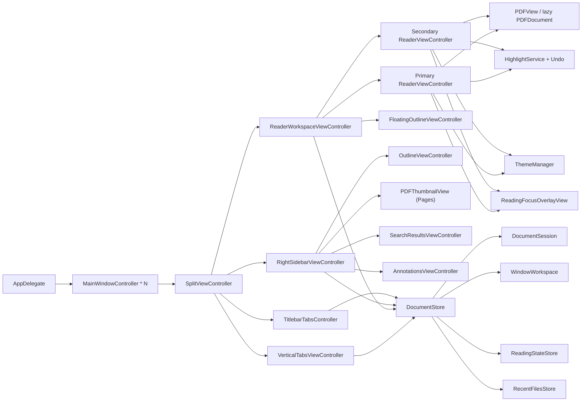

# PDF Reader for macOS

面向 macOS 的极简 PDF 阅读器。左侧文档 tabs(可切换到标题栏水平 tabs),右侧 Outline / Pages / Search / Annotations,中间沉浸式阅读区(支持同窗分屏与多窗口)。风格:极简、扁平、紧凑。

## 1. 产品原则

1. 左栏只回答"正在看哪些文档"、右栏只回答"当前文档结构"、中栏只回答"阅读本身"。
2. tab 形态可切换,垂直与水平模式共享同一套文档模型。
3. 水平 tab 复用 macOS 标题栏,不额外占内容高度。
4. 视觉极简扁平紧凑,避免厚重装饰、强阴影、松散间距。
5. 高频操作键盘驱动。
6. 不引入 fallback、兜底逻辑、不必要兼容层。

## 2. 范围

### 2.1 V1 涵盖

文档管理 / 空白标签页 / PDF 库文件夹 / 阅读(单页·双页·书籍、适应宽度、缩放、翻页、鼠标跟随聚焦)/ PDF 外部编译热重载 / 多 PDF 连续阅读 / 当前 PDF 路径复制 / 当前页复制为图片 / 选区文字、当前页图片与当前 PDF 发送到 Codex / `serein://open?file=…` 本地 PDF 深链 / Reveal in Finder / Open With 系统阅读器 / Outline / Search / 会话恢复 / 当前文档与跨打开文档搜索 / 文本高亮、下划线与删除线 / 批注评论 / 删除批注 / 手动 & 自动保存 / 批注导出(Markdown / Plain / JSON) / 系统 Share / Clean Copy 导出 / 深色主题 / 反色夜间 / 配置化快捷键 / 设置窗口 / 侧栏显隐 & 互换 / 全览 grid / show all tabs / 历史前进后退 / 重开最近关闭 / find bar / 跳转页 / Vim 翻页 / 批注撤销(50 步) / 同窗分屏 / 多窗口恢复 / macOS 原生绿灯窗口管理。

### 2.2 V1 明确不做

- 自研 PDF 渲染器(直接 `PDFKit`)
- 文件树 / Finder 式侧栏
- 云同步 / 书签库 / 知识库
- 完美夜间模式 / 复杂微动效

## 3. 技术架构

### 3.1 选型

| 层级 | 选择 |
|---|---|
| 语言 | Swift |
| UI | AppKit(主阅读窗口)|
| PDF | PDFKit |
| 目录树 | NSOutlineView |
| 布局 | NSSplitViewController |
| 窗口样式 | `NSWindow.ToolbarStyle.unifiedCompact` |

### 3.2 架构图



### 3.3 关键设计决策

| 决策 | 结论 |
|---|---|
| 多文档管理 | `DocumentStore` 持有多个 `DocumentSession` |
| 多窗口管理 | 单 `DocumentStore` 持有多个 `WindowWorkspace`;每窗独立维护自己的 session/tab 集合,支持合并窗口,并通过菜单或 tab 拖拽把 PDF 原样移到新窗口 / 已有窗口 |
| tab 展示 | `verticalSidebar` / `horizontalTitlebar` 动态切换,共用同一套文档切换命令 |
| 中栏承载 | `ReaderWorkspaceViewController` 管理单 Reader / 双 Reader 分屏 |
| 目录来源 | 右栏或浮动目录需要时才从 `PDFDocument.outlineRoot` 抽取 `OutlineNode` |
| 搜索预览 | find bar 只负责输入 / scope / 大小写 / 全词 / 导航,所有 preview 与命中列表都放右栏 |
| 搜索范围 | `This Document` / `All Open`;`All Open` 只覆盖当前窗口已打开文档,跨文档命中点击先切 session 再跳转；结果以窗口级 `SearchSnapshot` 显式重建，读取不触发 PDF IO |
| 多 PDF 连续阅读 | 窗口级连续组保存有序 session IDs;不合成虚拟 PDF,只在页边界切换到组内相邻 PDF |
| PDF 热重载 | `DocumentStore` 通过文件 / 目录事件监听已打开 PDF,空闲时不轮询;原地写入只检查对应文件,原子替换及目录重建后重新绑定监听;只重载 clean sessions,优先恢复 PDFView 实时页码;dirty 批注会话保持内存状态 |
| PDF 库 | 配置保存库文件夹路径;首次打开库时递归扫描 PDF,建立轻量 root / folder / search 索引并缓存,用轻量搜索面板打开目标文件 |
| 批注存储 | Serein 多行 highlight / underline / strikeout 仅以 UUID `userName` 组成 group,共享评论仅写入首条批注的标准 `/Contents`,显示一个评论图标;打开旧文件时合并组内相同评论,保留不同内容及外部批注;外部 PDF 批注按 `/NM` 独立识别,避免同作者批注误合并;dirty 后 `Cmd+S` 或自动保存策略触发时写回源 PDF |
| 批注摘要 | 只使用 PDFKit 文本层生成 snippet；无文本层时显示 `Untitled Highlight`，不做 OCR / 页面栅格化 |
| 评论交互 | 有评论的高亮 / 下划线 / 删除线 hover 延迟显示预览(无评论不弹;右栏同条已选中时抑制);预览与编辑共用批注旁的无边框 `NSPanel`,单击图标或预览原地编辑,保持宽度与靠近图标的一角,避开图标;鼠标跨入卡片有 150ms 宽限,编辑时移出不关闭;双击批注 / `Cmd+Option+M` / 右键也可编辑,不强制打开右栏;应用接管批注点击与右键,不打开 PDFKit 黄色编辑器;卡片采用 6pt 圆角与紧凑底边距,空评论最小输入高度 20pt,长评论随内容增高并在上限后滚动;底部右侧显示 `Save ⌘↩`,Esc 保留取消操作但不显示提示;卡片随主题刷新;右栏为全高评论流,支持行内编辑、右键改色 / 删除 / 复制,跳转用短时 pulse 而非虚线选区 |
| 高亮颜色 | `HighlightColor` 保持 pink / yellow / green 语义色;`NightModeStyle` 按 Normal / Rose Pine Dawn / Rose Pine Moon 解析实际 sRGB/alpha 调色板 |
| 系统文档集成 | 成功打开真实 PDF 后同步 `NSDocumentController` recent documents;主窗口 `representedURL` / `representedFilename` 跟随当前 active PDF;`serein://open?file=<encoded file URL>` 仅接收单个本地可读 PDF 并复用同一打开管线 |
| Codex 交接 | `Ctrl+Cmd+C` 按上下文发送:有选区时通过 `codex://new?prompt=…` 预填新任务,无选区时导出当前页临时 PNG;`Ctrl+Cmd+Shift+C` 使用原 PDF;文件通过 macOS 打开事件交给 `com.openai.codex`;Settings 可关闭整个集成;不传 workspace `path`,Codex 客户端可能自行把文件父目录作为 workspace |
| 外部应用 | `Reveal in Finder` 与 `Open With` 保持独立;File 菜单和两种 tab 右键菜单按系统适配顺序动态列出已安装 PDF 应用,对 dirty PDF 先执行保存确认 |
| 重复打开 | 外部 `open`、Open Recent、PDF Library 或 `Cmd+O` 选到已打开 PDF 时激活已有 window/session,不创建重复普通 tab |
| 自动保存 | 默认 `10 min`,可设 `never` |
| 分屏默认 | 新窗口始终空白且默认单屏;跨启动恢复也默认回到单屏;分屏只作为当前运行期内的主动切换状态 |
| 分屏方向 | `ReaderSplitLayout` 为窗口运行期状态,支持左右 `sideBySide` / 上下 `stacked`;切换方向不改 pair、pane session 与焦点 |
| 分屏 pair | `ReaderSplitPair` 只记录当前运行期绑定的两个 PDF;普通 tab 点击会恢复 pair 或临时离开 pair,只有 `Option` 激活才替换 pane |
| 同 PDF 对比 | 同一个 PDF 的第二 pane 使用内部 comparison session,独立页码 / 缩放,但不显示成普通 tab、不进入最近 / 重开 / 持久化 / All Open 搜索 |
| 状态持有 | 阅读状态 / 缩放 / 翻页 / dirty / undoStack 挂在 `DocumentSession`;搜索结果是窗口级 `SearchSnapshot`,session cache 仅为内部构建细节;live `PDFDocument` 由 `DocumentStore` 小容量 LRU 按需持有;侧栏显隐 / 宽度等窗口 UI 状态挂在 `WindowWorkspace` |
| 阅读聚焦 | `ReadingFocusOverlayView` 只绘制一个 even-odd 圆角镂空遮罩与轻量边缘阴影,不接管 PDF hit-test;默认宽高来自 config,`Option+F` 只覆盖当前窗口并同步双 pane |
| 演示工具 | 演示模式提供指针、临时笔与激光;墨迹按 PDF 页坐标保存在当前阅读区,翻页保留并随页面定位,各窗口独立,退出演示或切换文档时清空,不写入 PDF;底部工具栏可固定或自动隐藏 |
| 全览性能 | `OverviewGridView` 缩略图只按可视区 ± 一屏懒栅格化(离主线程、2 并发、像素长边上限 1200);`NSCache` 按字节成本回收,远端页释放位图,退出全览立即清空并取消排队任务、释放其 PDF 和结果;缩放 / resize 只重渲可视区,滚回近访页走缓存不重渲;右栏 Pages 仅在面板可见时绑定 PDFView |
| 书籍阅读 | 新增 `book` / `bookContinuous`,与既有 `twoUp` / `twoUpContinuous` 并存;两个书籍状态复用横向 `PDFView.twoUp + displaysAsBook` 布局,封面单页,后续按左右 spread 配对;封面与末尾孤页保留空槽以稳定页面尺寸;Fit Width 按实际页面框与固定安全边距同时约束宽高,手动缩小后只要完整可见也保持双轴居中;Continuous Turn 允许持续手势逐 spread 翻页 |
| 左右互换 | `layout.sidebarsSwapped` 翻转时 split items 重排,window-level 宽度 / 可见状态原子对调 |
| 空窗策略 | 无 session 时右栏(outline pane)自动折叠,中栏独占窗口;首开文档自动恢复右栏,除非空窗期间用户显式切换过可见性(显式操作让位);左栏常驻并托管 Recent 快捷入口 |
| 右栏无文档态 | 无文档(无 session 或空白 tab)时隐藏 segmented 与各 mode 面板,只显示居中共享空态,模式机制与懒加载保持原样 |
| 空态组件 | 左 / 右栏空态与 placeholder 共用 `EmptyStateView`(12 semibold / 11 secondary,居中文案块),宿主决定位置;面板级上下文空文案沿用 12pt secondary |
| 侧栏外观 | 左右侧栏与中栏共用 `readerBackdrop` 实色平面(无 vibrancy 缝、无分割线);`layout.sidebarOpacity` 仅保留配置兼容,Settings 不再暴露无效控件;文档侧栏空白背景可拖窗,不抢 tab / close / scroll 事件 |
| 高亮撤销 | 每 session 独立 undo 栈,上限 50,无 redo |
| 视图层订阅 | 通过 `Notification.Name.documentStoreDidChange` 与 `PDFViewPageChanged`,视图层不持业务状态 |

## 4. UI 与交互

### 4.1 信息架构

| 区域 | 职责 | 边界 |
|---|---|---|
| 左栏 Vertical Sidebar | 已打开文档 tabs | 不放 outline / 不放缩略图 / 不做文件树 |
| 标题栏 Horizontal Tabs | 水平模式下的 tab strip | 占标题栏,不新增内容区 tab bar |
| 中栏 Reader Workspace | PDF 渲染、选择、find bar、批注、全览、同窗分屏 | 单窗最多双 Reader;高亮 hover 显示轻量评论预览;正文右键菜单结构统一并按命中启用操作,含复制当前页为图片、发送选区文字 / 当前页图片到 Codex;普通 tab 切换只恢复 / 离开 split pair,`Option` 激活才按焦点 pane 编辑分屏;右栏未显示 Outline(侧栏关闭,或 mode 为 Pages / Search / Annotations)且当前 PDF 有目录时,阅读区右缘显示浮动目录轨,hover 展开;展开高度随可见目录行收缩,受配置 / 当前窗口拖拽值与阅读区可用高度共同限制,超出时内部滚动;拖动上下边缘以中心对称调节高度上限,不触发 PDF reflow |
| 右栏 Sidebar | Outline / Pages / Search / Annotations (segmented 切换) | Annotations 为全高紧凑评论流(仅页 section + 原文 / 评论,无时间戳,无横向滑动);连续阅读时 Outline 按 PDF 分组连续显示;长目录标题自动换行且 pane 保持紧凑、无水平滑动;目录树支持筛选与一键折叠 / 展开;所有预览类内容都在右栏,仅正文 hover 评论卡与非 Outline 态浮动目录可覆盖中栏 |
| 左右互换 | 配置项或 `Cmd+Shift+X` | 不改变上述职责,仅改变物理位置 |

### 4.2 视觉规范

- 紧凑布局,轻量圆角,无厚重阴影
- 常规侧栏平铺嵌入,最多保留一条淡分割线;右栏隐藏态的浮动目录使用当前主题 pane 色与轻透明背景,保持轻描边、紧凑、无厚重阴影
- 按钮 / tab 视觉重量轻,突出选中态
- 水平 tab 与系统标题栏融为一体,宽度随标题内容自适应
- 外观配置拆为 `Mode` + `Light Theme` + `Dark Theme`,默认 `system + normal + rose_pine_moon`
- 亮色至少支持 `normal` / `rose_pine_dawn`,暗色至少支持 `normal` / `rose_pine_moon`
- `rose_pine_dawn` 仅把 PDF 白底映射成接近 Obsidian 的暖纸色,保留正文与图表原色;侧栏使用不透明的扁平主题表面
- `rose_pine_moon` 把 PDF 白底 / 黑字映射到 Moon 纸面 / 正文端点,保留暖冷强调色方向,并用更深的侧栏底色建立层级
- `Settings` 的 General / Library / Shortcuts 固定为统一紧凑宽度,只允许高度按页适配;General 按 Appearance / Reading / Layout 分组,Shortcuts 支持搜索与分组,使用双层信息紧凑行,内置二段式快捷键以独立键帽显示且禁止横向滚动
- 高亮模式提示使用轻量 inline 状态,不使用居中大块 badge
- 评论预览卡与右栏评论行使用轻选中态、细色条和受限行数,避免永久详情编辑器挤占列表;预览卡按行 wrap(更宽上限),右栏行内不重复 section 的 Page 文案
- 切换 PDF 后在阅读区顶部短暂显示当前文件名,帮助快速定位但不常驻占位
- 阅读聚焦使用单一圆角矩形镂空与统一外围压暗,禁止多方向渐变拼接;轻描边 / 阴影只强化焦点边界,不得污染框内文字
- 空窗 / 空白 tab 时中栏显示淡色 Baskerville 衬线斜体 `Serein`，按阅读区宽度 82% 缩放并受高度 65% 限制，居中略偏上、随主题换色；打开 PDF 或加载错误时隐藏。无标签时隐藏标题栏 tab 容器，创建标签后恢复
- 空窗时左栏显示 `Documents` section 标题 + 上移的 Recent 快捷入口(无 recents 或关闭时显示共享提示文案);右栏无文档态只保留居中空态文案,不显示 segmented 等"已就绪"chrome
- 默认高亮色:偏轻、低饱和但清晰的粉色

### 4.3 快捷键总表

配置文件:`~/Library/Application Support/Serein/config.toml` — schema 与默认值见 `Core/AppConfiguration.swift`;`access.root_bookmarks` 由 Serein 管理,默认用于跨重装保留 `/Users` 访问授权。`[updates]` 控制 GitHub Releases 自动更新(`auto_check` / 私有仓库所需的 `github_token`)。

`Cmd+K` 保留给 Command Palette;配置项只定义可选的单段直接入口,设为 `none` 不会移除只读的内置二段组合。

**批注**
- `A`:有选区 → 立即高亮;无选区 → 进入高亮模式
- `U`:有选区 → 立即加下划线;无选区 → 进入下划线模式
- `S`:有选区 → 立即加删除线;无选区 → 进入删除线模式
- `Cmd+Option+M`:有选区 → 创建高亮并进入评论编辑;无选区且命中高亮 → 编辑已有评论
- 高亮模式内 `1` / `2` / `3`:切换粉 / 黄 / 绿;文本输入框优先接收数字
- `Esc`:退出批注模式 / 关闭 Find bar / 退出全览;演示时先将笔或激光切回指针,再按退出演示
- `D`:删除鼠标所在批注(多行整组删除)
- `Cmd+S`:写回源 PDF
- `Cmd+K` → `Cmd+E`:系统 Share 当前 PDF,可选 Original / Clean Copy / Highlights
- `File > Export Clean Copy…`:导出移除可见用户批注、保留链接与表单控件的 PDF 副本
- `File > Export Highlights…` / `Export All Open Highlights…`:导出当前 PDF 或当前窗口全部已打开 PDF 的批注;汇总格式按 Document → Page 分组
- `Cmd+Z`:撤销最近一次批注新增或删除(上限 50,无 redo)

**阅读**
- `Cmd+K`:打开紧凑网格 Command Palette;按分区两列排布当前可执行命令,`↑` / `↓` / `←` / `→` 选择,`Enter` 或点击执行,`Esc` 或再次 `Cmd+K` 关闭;面板打开时可直接按原有第二段组合
- `Cmd+0` / `Cmd+9`:适应宽度 / 适应高度
- `Cmd+Option+0`:主阅读区按当前页或当前双页的文字字形边界一次缩放,左右各留 12pt,保持垂直阅读位置;结果为手动缩放,无文本时保持现状;`fit_text_width` 可在 Settings → Shortcuts 修改,`Cmd+0` 继续适应页面宽度
- `Cmd+=` / `Cmd+-`:放大 / 缩小(进入 manual 缩放)
- 物理右 `Cmd+1` / `Cmd+2` / `Cmd+3` / `Cmd+4` 保持 `Single Page` / `Single Page Continuous` / `Two-Up` / `Two-Up Continuous`;`Book` / `Book · Continuous Turn` 默认无快捷键,可从 View 菜单或 Settings 选择
- `C` 在当前单页、双页或书籍布局内切换对应连续状态
- 书籍模式以居中封面开场,之后显示稳定页面尺寸的左右双页;Fit Width 按实际 spread 尺寸保留水平 32pt / 垂直 24pt 安全边距并完整居中,手动缩小到完整可见时继续居中;普通状态每个横向手势翻一组,Continuous Turn 可在持续手势中逐组翻页;放大时先在 spread 内惯性平移,到边缘后翻页,翻页后的惯性不会连跳;`H` / `←` 与 `L` / `→` 分别翻到上一 / 下一 spread
- `singlePage` 完整放下当前页时双轴居中并钳制空白区域滑动;放大到超出视口后仍允许页内平移
- `L`:切换水平平移锁定(保持当前 X 位置并禁止左右滑动与捏合 / 快捷键缩放,竖直滚动与翻页不受影响;按焦点 pane)
- `J` / `K`:下一页 / 上一页(文本输入上下文让路)
- `Ctrl+D` / `Ctrl+U`:下滚 / 上滚半页;非连续模式先走完当前 PDF,到边界才切换连续阅读组中的相邻 PDF
- `G` / `g`:跳到真实文末页底 / 文首页顶
- `Cmd+Option+G`:跳转到页 N(越界给轻量提示)
- `Cmd+[` / `Cmd+]`:按 pane 保存 `sessionID + ReadingPosition` 的精确历史;支持同页不同坐标、跨 PDF Outline / Search 与反复后退 / 前进;PDF 内链单击预览目标页,预览使用 6pt 圆角无标题栏面板、铺满宽度;根据目标附近的文字位置识别双栏并放大目标栏,左右正文错行、短公式与上下标不影响分栏识别,栏宽包含公式编号;单栏、跨栏标题或布局不明确时默认按整页文字左右边界缩放,左右各留 12pt;无可提取文字时保持整页宽度;预览内继续点击内链时原地替换页面,左上角后退 / 前进恢复预览的页码、滚动与用户调整的缩放,后退后点新链接会清除前进分支;预览历史独立于主阅读区,关闭后清空;每次仅复制当前页且不显示评论入口,不裁切或修改源 PDF 与批注;阅读区 Option-click 或预览右上角跳转图标才把当前目标居中跳转并入主历史栈,普通滚动和顺序翻页不入栈
- `Cmd+F` / `Cmd+G` / `Cmd+Shift+G`:Find bar(有 PDF 选中文本时立即带入搜索)/ 下一 / 上一 匹配
- Find bar 内 `Aa` / `Word`:切换区分大小写 / 全词匹配;`↑` / `↓` / `Enter` 选择上一 / 下一结果 / 首次提交搜索;同一 query + scope + options 连续 `Enter` 继续跳转
- `F`:开启 / 关闭鼠标跟随阅读聚焦;遮罩按真实 PDF 页宽定位且不阻断选择、链接、拖拽与滚动
- `Option+F`:调整当前窗口聚焦宽度(Page / Column / Custom)与高度;默认值在 Settings General 或 `[reader]` 配置
- `I`:仅在本次运行中临时切换 light / dark mode,不改配置;再次按下或在 Settings 明确修改 Mode 后恢复持久化设置,并保留各自已选 theme
- `Cmd+K` → `Cmd+T`:切换当前外观侧的 theme(亮色切 `normal` / `rose_pine_dawn`,暗色切 `normal` / `rose_pine_moon`)
- `Cmd+K` → `Cmd+O`:从配置的 PDF 库文件夹扫描并打开二级库浏览面板
- `Cmd+K` → `Cmd+R`:刷新并重扫 PDF 库索引
- `Cmd+K` → `Cmd+L` / `Cmd+K` → `Cmd+S`:打开 Settings 的 Library / Shortcuts 页

**文档与 tab**
- `Cmd+T`:新建空白 tab;空白 tab 不绑定 PDF、不进入最近 / 重开历史、不跨启动恢复
- `Cmd+O`:打开 PDF 或文件夹(自动扫描并打开文件夹内 PDF,支持多选文件夹)
- `Cmd+R`:在 Finder 中显示当前 PDF
- `Cmd+Shift+C`:复制当前 PDF 路径到剪贴板
- `Cmd+Option+C`:复制当前页为图片(2× mediaBox,含批注,不含夜间滤镜);阅读区右键同样提供
- `Ctrl+Cmd+C`:有选区时发送文字到 Codex,否则发送当前页图片;`Ctrl+Cmd+Shift+C`:发送当前 PDF;Reader 右键按当前上下文只显示一项;Settings > General 可关闭 Codex 集成
- `File > Open With` 或 PDF tab 右键:动态选择兼容的已安装应用打开 PDF;`Reveal in Finder` 独立保留
- `Cmd+W`:多选 tabs 时关闭选中的 PDFs;否则关闭当前 tab
- `Cmd+Shift+W`:关闭当前窗口
- `Cmd+Shift+T`:重开上次关闭(栈上限 10)
- `Cmd+Shift+N`:新建窗口
- `Cmd+K` → `Cmd+M`:合并所有窗口到当前窗口
- `Cmd+K` → `Cmd+N`:把当前 PDF 移到新窗口
- `Window > Move Current PDF to Window`:移到指定已有窗口;垂直 / 标题栏 tab 也可直接跨窗拖拽
- `Cmd+Shift+Space`:最近文件启动器;阅读器抢回焦点后 `Esc` 仍先关闭面板
- `Ctrl+Tab`:显示当前窗口所有 tabs 的轻量文本总览;点击 / Enter 普通切换,`Option+Click` / `Option+Enter` 进入 split-edit;重复 `Ctrl+Tab` 或 `Esc` 关闭
- 多 PDF 连续阅读:批量打开会预选本批 PDF,也可 `Cmd` / `Shift` 点击多选后通过 tab 右键菜单开启 / 退出
- `Cmd+Shift+[` / `Cmd+Shift+]`:上一 / 下一 tab
- 物理左 `Cmd+1` / `Cmd+2` / `Cmd+3`:激活当前窗口第 1 / 2 / 3 个 tab
- `Option+Click` tab:进入 split-edit;已分屏时替换当前焦点 pane,未分屏时以当前 PDF + 目标 PDF 建 pair

**布局**
- `Cmd+B` / `Cmd+Option+B`:切换左 / 右侧栏
- `Cmd+Shift+1` / `Cmd+Shift+2`:垂直 sidebar tabs / 水平 titlebar tabs
- `Cmd+Shift+L`:右栏 Outline / Pages 切换
- `Cmd+Ctrl+\`:切换同窗分屏;次级 pane 显示紧凑候选,首项为同一个 PDF;`View` 菜单可在左右 / 上下布局间切换(新窗口与重启恢复默认单屏)
- `Cmd+Shift+O`:进入 / 退出全览(自动隐藏左右侧栏,视口自适应铺满页网格,缩放后为手动尺寸,`Esc` 退出)
- `Cmd+L`:进入 / 退出演示模式(直接全屏播放,页面完整适配并复用单页居中钳制,退出后恢复进入前布局)
- 演示中 `P` / `R`:切换临时笔 / 激光,重复按键回到指针;`V`:回到指针;`Cmd+Z`:撤销当前页最后一笔;`E`:清空当前页墨迹;`Esc`:先回到指针,再按退出演示
- 演示工具栏默认固定在底部;取消固定后自动隐藏,移到阅读区底部中央或点击展开按钮即可显示;激光移动轨迹会自动淡出
- `Cmd+Ctrl+L`:双侧栏都关闭时打开两个侧栏;否则关闭两个侧栏与 tab chrome
- `Cmd+Shift+X`:互换左右侧栏(宽度 / 可见状态随内容迁移)

**系统**
- `Cmd+H` / `Cmd+Option+H`:隐藏当前 app / 隐藏其他 app
- `Cmd+M`:最小化当前窗口
- macOS 绿灯菜单:主窗口支持系统 Full Screen、Move & Resize、Fill、Center、Fill & Arrange;默认打开尺寸保持宽裕,最小尺寸保持可进入系统半屏与四分屏布局

### 4.4 批注保存策略

- 高亮 / 下划线 / 删除线新增或删除后只更新 session 与 dirty 标记,**不立即落盘**
- 多行批注视为一组,删除任一行时整组删除
- `Cmd+S`:当前文档未保存批注覆盖写回源 PDF
- 关闭 dirty tab 或退出 app 时必须提示 `Save / Cancel / Discard`
- 自动保存:默认 `10 min`,至少支持 `10 min` / `never`;失败需显式提示

## 5. 数据模型

### 5.1 `DocumentSession`

| 字段 | 说明 |
|---|---|
| `id: UUID` | session 唯一标识 |
| `url: URL` | PDF 位置 |
| `title: String` | 标题或文件名 |
| `pageCount: Int?` | 激活或搜索后得到的页数元数据 |
| live `PDFDocument` | 不存入 session,由 `DocumentStore` 按需加载并通过小容量 LRU 保留当前 / 分屏 / 最近文档 |
| `currentPageIndex: Int` | 当前页 |
| `displayMode` | 六种阅读模式：单页 / 单页连续 / 双页 / 双页连续 / 书籍 / 书籍连续翻页 |
| `scaleMode` | `fitWidth` / `manual` |
| `zoomScale: CGFloat` | 缩放比例 |
| `lastReadPosition` | 页码 + 页内位置 |
| `needsInitialReadingPosition` | 无持久化阅读位时,首次布局落到真实页顶而非 PDF 坐标原点 |
| `outlineTree: [OutlineNode]` | 目录树 |
| `isDirty: Bool` | 是否有未保存批注 |
| `fileSnapshot` | 外部文件变化检测快照(mtime / size / inode) |
| `tabPresentationState` | 当前 tab 模式下的局部状态 |
| `annotationSavePolicy` | `after10Minutes` / `never` |
| `undoStack` | 高亮撤销栈,上限 50 |
| `searchCache` | 内部搜索构建缓存(query + options + snippet + page + selection),不作为 UI 读取接口 |

### 5.2 `DocumentStore`

- 管理 sessions(open / close / activate / reorder / 跨窗口 move)
- 维护多个 `WindowWorkspace`,驱动多窗口 / 分屏 / 焦点 pane / 右栏模式 / 搜索 scope
- 每个 `WindowWorkspace` 独立维护自己的 session/tab 集合,open/close 不跨窗扩散
- 维护 active session 与运行期 split pair,驱动左栏 tab 与中栏 reader 联动
- 按需创建 `PDFDocument`,用小容量 LRU 保留当前 pane / 分屏 pane / 最近文档;干净后台文档可释放
- 监听已打开 PDF 的外部改写;clean session 清理缓存并触发 UI 重读,Reader 在替换 document 前捕获实时阅读位并恢复;dirty session 不自动刷新
- 持久化阅读状态 / 最近文件 / 每窗口最近关闭栈(上限 10)
- `DocumentStoreChange` 区分 chrome / content / `readingPosition`;翻页与缩放写回不触发 tab / search / annotations 列表全量重建,也不重写 workspace 快照
- Reader 在缩放命令与新增高亮通知前完成待写回阅读状态,避免刷新时恢复旧位置或旧缩放
- `searchSnapshot(in:)` 纯读；query / scope / options、pane 焦点、tab 与热重载边界显式调用 `rebuildSearchIfNeeded(in:)`
- `ReadingStateStore` 每文档阅读位:上限 500(LRU)、磁盘写入 debounce、退出时 flush;失败走 `os.Logger`
- 提供 tab 模式切换
- 左右互换时对调 `WindowWorkspace` 的 window-level 宽度 / 可见状态

### 5.3 `WindowWorkspace`

| 字段 | 说明 |
|---|---|
| `id: UUID` | window 唯一标识 |
| `sessionIDs: [UUID]` | 当前窗口拥有的 tab 顺序 |
| `selectedSessionIDs` | 当前 tab 多选集合,用于连续阅读入口 |
| `continuousReadingState` | 当前窗口的多 PDF 连续阅读组,按 session 顺序保存 |
| `tabPresentationMode` | 当前窗口 tabs 形态 |
| `rightSidebarMode` | `outline` / `pages` / `search` / `annotations` |
| `searchQuery` / `searchScope` | 当前窗口搜索上下文 |
| `isSplitEnabled` | 当前是否显示双 Reader |
| `splitLayout` | 当前运行期左右 / 上下分屏方向,不跨启动恢复 |
| `primarySessionID` / `secondarySessionID` | 两个 pane 当前展示的 session;secondary 可为空候选态 |
| `splitPair` | 当前运行期绑定的两个 PDF,不跨启动恢复 |
| `focusedPane` | split-edit 与搜索跳转的落点 |
| `recentlyClosedURLs` | 本窗最近关闭栈 |
| `leftSidebarWidth` / `rightSidebarWidth` | 当前窗口运行期侧栏宽度,由配置默认值初始化,不随 PDF 切换 |
### 5.4 辅助模型

| 模型 | 用途 |
|---|---|
| `ReaderState` | 阅读区 UI 状态 |
| `OutlineNode` | 目录树节点 |
| `ReadingPosition` | 页码 + 页内定位 |
| `TabPresentationMode` | `verticalSidebar` / `horizontalTitlebar` |
| `ReaderSplitPair` | 浏览器式分屏绑定,把"显示分屏"与"绑定哪两个 PDF"分开 |
| `AnnotationSavePolicy` | `after10Minutes` / `never` |
| `HighlightPalette` | Normal / Rose Pine Dawn / Rose Pine Moon 的高亮色预设 |
| `HighlightUndoOperation` | undo 栈元素 |
| `SearchSnapshot` | 当前窗口不可变搜索结果与构建 source |
| `ThemeRegistry` / `ThemeSnapshot` | curated 主题 descriptor 注册表与不可变颜色快照 |

## 6. 项目结构

```text
App/                                      # AppKit 入口、窗口与设置/启动器
  AppMain.swift                           # @main 入口,构造 NSApplication 与 AppDelegate 并 run
  AppDelegate.swift                       # 应用委托:菜单、窗口生命周期、配置加载、自动保存驱动
  AppUpdateCoordinator.swift              # GitHub 更新:启动检查、菜单、下载进度、安装重启
  MainWindowController.swift              # 主窗口控制器:工具栏、titlebar tabs 宿主、demo/immersive 模式
  ReaderShortcutWindow.swift              # 自定义 NSWindow,拦截 keyDown 分发 reader 快捷键
  SplitViewController.swift               # 三栏 NSSplitViewController:左 tabs / 中 reader / 右 sidebar
  SettingsWindowController.swift          # 设置窗口:外观 / 阅读 / 批注 / 可搜索快捷键配置 UI
  CommandPaletteController.swift          # 紧凑网格命令面板与键盘交互
  CommandPaletteState.swift               # 命令网格导航与高亮选择状态(纯模型)
  ShortcutSequenceView.swift              # 单段 / 二段快捷键的符号芯片视图
  RecentFilesPaletteController.swift      # 最近文件启动器的窗口与交互控制器
  RecentFilesPaletteState.swift           # 最近文件启动器的查询匹配与多选状态(纯模型)
  PDFLibraryPaletteController.swift       # PDF Library 二级浏览面板:库 tab / 文件夹 / PDF 列表 / 搜索
  OpenTabsPaletteController.swift         # 当前窗口所有 tabs 轻量文本总览
  OpenTabsPaletteState.swift              # tabs 总览的选中状态(纯模型)

Core/                                     # 文档 / 窗口 / 配置 / 持久化 核心模型
  AppConfiguration.swift                  # config.toml schema、默认值与 AppConfigurationStore 读写
  AppUpdateService.swift                  # GitHub Releases 检测 / 下载 DMG / 安装替换
  SecurityScopedAccessController.swift    # `/Users` 等访问 root 的 security-scoped bookmark 持久访问
  PDFLibrary.swift                        # PDF 库扫描、root / folder / item catalog
  CleanPDFService.swift                   # 生成保留 Link / Widget、移除可见用户批注的 PDF 副本
  PDFPageImageService.swift               # 当前页栅格化为 NSImage 并写入剪贴板
  DocumentStore.swift                     # 多文档 + 多窗口中枢:sessions / workspaces / 命令入口
  DocumentStorePersistence.swift          # UserDefaults 编解码 sessions / workspaces / 非运行期窗口状态
  DocumentSession.swift                   # 单文档会话:页码、缩放、显示模式、dirty、undo 栈等
  PDFFileMonitor.swift                    # 已打开 PDF 的外部改写监听与文件快照
  DocumentAnnotations.swift               # 高亮分组 / 缓存 / 导出 相关数据模型
  DocumentSearch.swift                    # PDF 全文匹配与 preview snippet 构造(DocumentSearchService)
  WindowWorkspace.swift                   # 单窗口状态:tab 顺序、侧栏、搜索、分屏、焦点 pane
  OutlineExtractor.swift                  # PDFDocument.outlineRoot → [OutlineNode] 转换
  OutlineNode.swift                       # Outline 树节点数据结构
  ReaderState.swift                       # 阅读区 UI 状态(夜间、高亮模式、高亮颜色)
  ReaderDisplayMode.swift                 # 显示模式 / 缩放模式 / ShortcutCommand 枚举
  ReadingPosition.swift                   # 页码 + 页内坐标的阅读位置
  ReadingStateStore.swift                 # 每 PDF 的阅读状态 UserDefaults 持久化
  RecentFilesStore.swift                  # 最近文件 URL 栈 UserDefaults 持久化
  PDFTextSanitizer.swift                  # PDF 文本清洗(去控制字符、折叠空白)

UI/LeftTabs/                              # 左侧垂直 tabs
  VerticalTabsViewController.swift        # 左侧 tabs 列表视图控制器,含可选最近文件 footer
  VerticalTabItemView.swift               # 单个垂直 tab 条目视图

UI/TitlebarTabs/                          # 标题栏水平 tabs
  TitlebarTabsController.swift            # 标题栏 tabs 控制器,挂在 NSToolbarItem 上
  TitlebarTabItemView.swift               # 单个水平 tab 条目视图

UI/CenterReader/                          # 中栏阅读区
  ReaderWorkspaceViewController.swift     # 中栏 workspace:单 / 双 Reader 分屏 + 焦点 pane
  FloatingOutlineViewController.swift     # 右栏隐藏时的 Notion 式目录 rail + hover / 高度拖拽 overlay
  ReaderViewController.swift              # 单 Reader:PDFView、find bar、高亮、全览 grid 等交互
  ReaderReferencePreviewController.swift  # 内链预览与独立前进后退;Option-click / 当前预览 Jump 才真正跳转
  ReaderAnnotationInteractionController.swift # 高亮 hit-test、hover 预览、菜单、评论面板与 pulse
  PDFContainerView.swift                  # PDFView 宿主,承载阅读聚焦 overlay,切夜间模式时同步背景色
  ReadingFocusOverlayView.swift           # 鼠标跟随圆角镂空遮罩、页 / 栏 / 自定义宽度几何
  ReadingFocusControlsViewController.swift # 当前窗口聚焦宽高紧凑调节面板
  ReaderShortcutsController.swift         # reader 快捷键(j/k/g/…)分发
  FindBarView.swift                       # find bar:查询框 + scope / 大小写 / 全词切换 + 匹配导航按钮

UI/RightOutline/                          # 右栏 outline / pages / search / annotations
  RightSidebarViewController.swift        # 右栏容器,segmented 切换四种子模式
  OutlineViewController.swift             # 可筛选目录树与折叠状态
  SearchResultsViewController.swift       # 搜索命中列表,支持跨 session 跳转
  AnnotationsViewController.swift         # 批注列表与 comment 编辑

UI/Shared/                                # 跨栏复用视图
  SidebarMaterialView.swift               # 侧栏主题表面

Features/Annotations/                     # 高亮批注功能域
  HighlightColor.swift                    # 高亮颜色枚举(pink / yellow / green)与相近色匹配
  HighlightService.swift                  # 应用 / 删除 / 重建 高亮的核心逻辑
  HighlightExporter.swift                 # 单文档 / 当前窗口汇总导出 Markdown / Plain / JSON
  HighlightUndoOperation.swift            # 撤销栈元素:added / removed

Features/Theme/                           # 主题与夜间模式
  ThemeRegistry.swift                     # Normal / Dawn / Moon 的不可变 descriptor 与 snapshot
  ThemeManager.swift                      # @MainActor 全局主题选择唯一持有者
  NightModeStyle.swift                    # 基于 immutable snapshot 的动态颜色与 PDF 映射 facade

Resources/                                # 资源
  Info.plist                              # Bundle 信息与 PDF 文档类型声明
  AppIcon.icns                            # 应用图标(发布)
  AppIcon.png                             # 应用图标(源文件)

Scripts/                                  # 打包脚本
  ensure-local-codesign-identity.sh       # 创建 / 复用本机稳定签名身份
  make-app.sh                             # 构建 .app(稳定本机签名)
  make-dmg.sh                             # 打包 .dmg
  make-icon.sh                            # 生成 .icns 图标

Tests/SereinTests/                      # Swift Testing + XCTest 测试套件
  AppConfigurationTests.swift             # 配置加载 / 写回 / shortcut 冲突
  DocumentStoreTests.swift                # 多文档 / 多窗口 / 分屏 / 搜索 scope 等核心行为
  ReadingStateStoreTests.swift            # 阅读状态持久化
  RecentFilesStoreTests.swift             # 最近文件栈
  OutlineExtractorTests.swift             # PDF outline 解析
  OutlineViewControllerTests.swift        # 目录树视图交互
  FloatingOutlineViewControllerTests.swift # 浮动目录显隐 / hover / 自适应高度 / 拖拽上限 / swap / 跳页 / overlay 布局
  VerticalTabsViewControllerTests.swift   # 左栏 tabs 行为
  TitlebarTabsControllerTests.swift       # (若存在)标题栏 tabs 行为,否则见 WindowChromeTests
  RightSidebarViewControllerTests.swift   # 右栏 segmented 切换
  SearchNavigationTests.swift             # 搜索结果导航与跨 session 跳转
  FindBarViewTests.swift                  # find bar 输入 / scope / 导航
  AnnotationsViewControllerTests.swift    # 批注列表 / comment 编辑
  AnnotationSaveTests.swift               # 手动 / 自动批注保存策略
  CleanPDFServiceTests.swift              # Clean Copy 保留 Link / Widget 且不污染源文档
  PDFPageImageServiceTests.swift          # 当前页 2× 栅格化与剪贴板写入
  HighlightServiceTests.swift             # 高亮 apply / remove / 分组
  HighlightExporterTests.swift            # 三种导出格式
  HighlightUndoTests.swift                # 撤销栈上限与 added/removed 还原
  NightModeStyleTests.swift               # 夜间反色映射
  ReaderShortcutsControllerTests.swift    # reader 快捷键分发与文本上下文让路
  CommandPaletteStateTests.swift          # 命令网格导航、快捷键序列与高亮状态
  CommandPaletteControllerTests.swift     # 命令面板网格、执行与二段式键处理
  RecentFilesPaletteStateTests.swift      # 启动器模型的过滤 / 多选
  RecentFilesPaletteControllerTests.swift # 启动器控制器交互
  OpenTabsPaletteStateTests.swift         # show all tabs 预览目标与网格选中
  OpenTabsPaletteControllerTests.swift    # show all tabs 鼠标 / 键盘切换交互
  WindowChromeTests.swift                 # 窗口 chrome / 工具栏 / titlebar tabs 行为
```

## 7. 已完成里程碑(概览)

| 里程碑 | 状态 | 要点 |
|---|---|---|
| M1 MVP 骨架 | ✅ | 三栏、`DocumentStore`、tab 双模式、outline、会话恢复 |
| M2 阅读体验 | ✅ | 六种阅读模式、适应宽度、搜索、最近文件、阅读位置持久化、快捷键系统 |
| M3 高亮批注 | ✅ | 选区 + 键盘 `a` 高亮、`D` 删除、手动 / 自动保存、默认粉色 |
| M4 夜间与打磨 | ✅ | `ThemeManager`、反色夜间、压缩标题栏、视觉减重 |
| M5 设置与收口 | ✅ | 设置窗口(默认阅读模式 / fit-width / 自动保存策略);综合验收通过 |
| M6 体验打磨 | ✅ | plain 快捷键菜单可见、全览 grid、find bar、历史栈、Vim 翻页、缩放、页跳转、左右互换、高亮 undo;真实 PDF 手测与 200+ 页缩略图验证通过 |
| M7 搜索强化与对比阅读 | ✅ | 右栏 Search 面板、This Document / All Open、同窗分屏、多窗口、窗口级持久化、搜索与分屏状态测试补齐 |
| M8 批注深度化 | ✅ | 右栏 Annotations、评论编辑、Markdown / Plain / JSON 导出、Shortcuts 页、`none` 清空绑定;开发 + 手测通过 |
| M9 最近文件启动器 | ✅ | Spotlight 风格 recent-files palette,搜索 / 空格多选 / 回车打开 / 底部操作提示;开发 + 手测通过 |
| M10–M10.13 体验扩展 | ✅ | Framing、连续阅读、PDF 库、热重载、切换提示、绿灯窗口、空白 tab、路径复制、浏览器式分屏、Go to Page 焦点等;开发 + 手测通过 |
| M14 窗口工作流交互 | ✅ | PDF 跨已有窗口菜单 / 拖拽移动、热重载实时页码、左右 / 上下分屏、侧栏空白拖窗、左右物理 Command 数字键 |
| M15 阅读聚焦 | ✅ | `F` 鼠标跟随聚焦、`Option+F` 窗口调节、Settings 默认宽高、双栏半页模式、单路径圆角遮罩与暗色增强 |

已完成细项以 commit 历史、[CHANGELOG.md](CHANGELOG.md) 与 [docs/archive/](docs/archive/) 为准;活 [TASKS.md](TASKS.md) 只跟踪未完成项。

## 8. 待开发里程碑

执行勾选见 [TASKS.md](TASKS.md);工程债见 [REVIEW.md](REVIEW.md)。

### 8.1 Milestone 11(长期预研):扩展生态

只产出**设计决策 + 最小 PoC**,不承诺全量实现。

- 扩展机制 RFC:进程内 Swift 插件 / URL scheme / 外部 CLI / WebKit 壳 的候选比较
- PoC:若决策继续,把"导出高亮"重写为首个插件
- Serein Extension API 草稿
- 风险评估:沙箱、上架(若走 MAS)、维护成本;若推迟,说明"为什么现在不做"

### 8.2 M12 空窗体验收尾 ✅

- `M12-010`–`M12-014` 已完成:空窗右栏自动折叠(首开恢复,显式操作让位)、右栏无文档 chrome 弱化、左栏 `Documents` 标题 + Recent 上移、共享 `EmptyStateView`、空态留白校准。
- 暂缓项(`M12-D002`–`D006`)见 TASKS,有明确触发条件再开

### 8.3 Milestone 13.1 网站后续

- 实机截图替换占位、截图规范、release 下载说明;可选 Pages 部署与暗色主题截图

### 8.4 多主题预设

- 计划:[docs/theme-presets-plan.md](docs/theme-presets-plan.md)
- 在保留 `Mode + Light Theme + Dark Theme` 的前提下,把主题从硬编码扩展为可注册 curated 预设表

### 8.5 工程债(摘要)

- 中期:拆 `AppDelegate`;继续拆 `ReaderViewController` 的 scale / viewport / overview 与 `DocumentStore` 的 tab / annotation / persistence;config 表驱动

## 9. 风险

| 风险 | 策略 |
|---|---|
| 夜间模式对 `PDFView` 内部视图层级的依赖 | 保持轻量反色方案,不自研渲染管线;`PDFKitPrivateViewSentinelTests` 对 `ContentBackgroundView` / `PDFPageView` 做升级哨兵 |
| 多文档状态污染 | 状态严格挂 `DocumentSession`,视图层无业务状态 |
| 双 tab 模式分叉 | 共享同一套 `DocumentStore` 与切换命令 |
| 批注写回失败 | 保留 dirty + 显式提示,不静默 |
| 侧栏职责膨胀 | 严守"左栏只 tabs / 右栏只 outline+pages+search/annotations" |
| UI 过早打磨 | 主路径优先于视觉;新功能进 M7+ |
| config schema 四清单漂移 | `requiredKeys` 自愈 + default/render/required 一致性单测;根治见 [REVIEW.md](REVIEW.md) §5.2 表驱动 |
| 工程债与路线 | 亮点 / 短板 / 改进清单以 [REVIEW.md](REVIEW.md) 为权威;执行勾选同步 [TASKS.md](TASKS.md) |

## 10. 开发约束

1. 先结构正确,再视觉精致。
2. 不为未来假设场景预埋抽象。
3. 不写 fallback、不写兼容层。
4. 优先系统原生能力:`AppKit`、`PDFKit`、`NSOutlineView`、`NSSplitViewController`。
5. 任何改动回同步本文件;边做边漂移的决策要回头写进来。
6. 状态管理落在 `DocumentStore` / `DocumentSession`,不散到视图层。
7. 垂直 tab 与水平 titlebar tab 必须共享同一套文档切换命令与状态模型。
