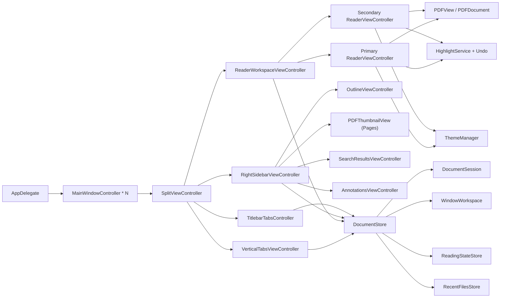

# PDF Reader for macOS

面向 macOS 的极简 PDF 阅读器。左侧文档 tabs(可切换到标题栏水平 tabs),右侧 Outline / Pages / Search / Annotations,中间沉浸式阅读区(支持同窗分屏与多窗口)。风格:极简、扁平、紧凑。

## 1. 产品原则

1. 左栏只回答"正在看哪些文档"、右栏只回答"当前文档结构"、中栏只回答"阅读本身"。
2. tab 形态可切换,垂直与水平模式共享同一套文档模型。
3. 水平 tab 复用 macOS 标题栏,不额外占内容高度。
4. 视觉极简扁平紧凑,避免厚重装饰、强阴影、松散间距。
5. 高频操作键盘驱动。
6. 不引入 fallback、兜底逻辑、不必要兼容层。

## 2. 范围

### 2.1 V1 涵盖

文档管理 / 阅读(单·双页、适应宽度、缩放、翻页)/ Outline / Search / 会话恢复 / 当前文档与跨打开文档搜索 / 文本高亮 / 高亮评论 / 删除高亮 / 手动 & 自动保存 / 高亮导出(Markdown / Plain / JSON) / 深色主题 / 反色夜间 / 配置化快捷键 / 设置窗口 / 侧栏显隐 & 互换 / 全览 grid / 历史前进后退 / 重开最近关闭 / find bar / 跳转页 / Vim 翻页 / 高亮撤销(50 步) / 同窗分屏 / 多窗口恢复。

### 2.2 V1 明确不做

- 自研 PDF 渲染器(直接 `PDFKit`)
- 文件树 / Finder 式侧栏
- 云同步 / 书签库 / 知识库
- 完美夜间模式 / 复杂微动效

## 3. 技术架构

### 3.1 选型

| 层级 | 选择 |
|---|---|
| 语言 | Swift |
| UI | AppKit(主阅读窗口)|
| PDF | PDFKit |
| 目录树 | NSOutlineView |
| 布局 | NSSplitViewController |
| 窗口样式 | `NSWindow.ToolbarStyle.unifiedCompact` |

### 3.2 架构图



### 3.3 关键设计决策

| 决策 | 结论 |
|---|---|
| 多文档管理 | `DocumentStore` 持有多个 `DocumentSession` |
| 多窗口管理 | 单 `DocumentStore` 持有多个 `WindowWorkspace`;每窗独立维护自己的 session/tab 集合,窗口只承载视图与交互 |
| tab 展示 | `verticalSidebar` / `horizontalTitlebar` 动态切换,共用同一套文档切换命令 |
| 中栏承载 | `ReaderWorkspaceViewController` 管理单 Reader / 双 Reader 分屏 |
| 目录来源 | `PDFDocument.outlineRoot` → `OutlineNode` |
| 搜索预览 | find bar 只负责输入 / scope / 导航,所有 preview 与命中列表都放右栏 |
| 搜索范围 | `This Document` / `All Open`;`All Open` 只覆盖当前窗口已打开文档,跨文档命中点击先切 session 再跳转 |
| 批注存储 | highlight group 共享 comment;dirty 后 `Cmd+S` 或自动保存策略触发时写回源 PDF |
| 自动保存 | 默认 `10 min`,可设 `never` |
| 分屏默认 | 新窗口始终空白且默认单屏;跨启动恢复也默认回到单屏;分屏只作为当前运行期内的主动切换状态 |
| 状态持有 | 阅读状态 / 缩放 / 翻页 / dirty / undoStack / searchCache 挂在 `DocumentSession`;窗口 UI 状态挂在 `WindowWorkspace` |
| 左右互换 | `layout.sidebarsSwapped` 翻转时 split items 重排,per-session 宽度 / 可见状态原子对调 |
| 高亮撤销 | 每 session 独立 undo 栈,上限 50,无 redo |
| 视图层订阅 | 通过 `Notification.Name.documentStoreDidChange` 与 `PDFViewPageChanged`,视图层不持业务状态 |

## 4. UI 与交互

### 4.1 信息架构

| 区域 | 职责 | 边界 |
|---|---|---|
| 左栏 Vertical Sidebar | 已打开文档 tabs | 不放 outline / 不放缩略图 / 不做文件树 |
| 标题栏 Horizontal Tabs | 水平模式下的 tab strip | 占标题栏,不新增内容区 tab bar |
| 中栏 Reader Workspace | PDF 渲染、选择、find bar、批注、全览、同窗分屏 | 单窗最多双 Reader,焦点 pane 决定 tab 落点 |
| 右栏 Sidebar | Outline / Pages / Search / Annotations (segmented 切换) | 所有预览类内容都在右栏,不回流到中栏 |
| 左右互换 | 配置项或 `Cmd+Shift+X` | 不改变上述职责,仅改变物理位置 |

### 4.2 视觉规范

- 紧凑布局,轻量圆角,无厚重阴影
- 侧栏平铺嵌入,最多保留一条淡分割线(禁悬浮 / 液态玻璃 / 漂浮面板感)
- 按钮 / tab 视觉重量轻,突出选中态
- 水平 tab 与系统标题栏融为一体
- `Settings` 按当前页内容自适应尺寸,`Shortcuts` 页会自动放大到合适大小
- 默认高亮色:偏轻、低饱和但清晰的粉色

### 4.3 快捷键总表

配置文件:`~/Library/Application Support/SlatePDF/config.toml` — schema 与默认值见 `Core/AppConfiguration.swift`。

**批注**
- `A`:有选区 → 立即高亮;无选区 → 进入高亮模式
- `Esc`:退出高亮模式 / 关闭 Find bar / 退出全览
- `D`:删除鼠标所在高亮(多行整组删除)
- `Cmd+S`:写回源 PDF
- `Cmd+Z`:撤销最近一次高亮新增或删除(上限 50,无 redo)

**阅读**
- `Cmd+0`:适应宽度
- `Cmd+=` / `Cmd+-`:放大 / 缩小(进入 manual 缩放)
- `Cmd+1` / `Cmd+2` / `Cmd+3` / `Cmd+4`:`singlePage` / `singlePageContinuous` / `twoUp` / `twoUpContinuous`
- `J` / `K`:下一页 / 上一页(文本输入上下文让路)
- `Cmd+Option+G`:跳转到页 N(越界给轻量提示)
- `Cmd+[` / `Cmd+]`:历史后退 / 前进
- `Cmd+F` / `Cmd+G` / `Cmd+Shift+G`:Find bar / 下一 / 上一 匹配
- Find bar 内 `↑` / `↓` / `Enter`:选择上一 / 下一结果 / 首次提交搜索;同一 query 连续 `Enter` 继续跳转
- `I`:切换反色夜间模式

**文档与 tab**
- `Cmd+O`:打开
- `Cmd+W`:关闭当前 tab
- `Cmd+Shift+T`:重开上次关闭(栈上限 10)
- `Cmd+Shift+N`:新建窗口
- `Cmd+Shift+[` / `Cmd+Shift+]`:上一 / 下一 tab
- `Option+Click` tab:丢到另一 pane(必要时自动开分屏)

**布局**
- `Cmd+B` / `Cmd+Option+B`:切换左 / 右侧栏
- `Cmd+Shift+1` / `Cmd+Shift+2`:垂直 sidebar tabs / 水平 titlebar tabs
- `Cmd+Shift+L`:右栏 Outline / Pages 切换
- `Cmd+Ctrl+\`:切换同窗分屏(新窗口与重启恢复默认单屏)
- `Cmd+Shift+O`:进入 / 退出全览(自动隐藏左右侧栏,`Esc` 退出)
- `Cmd+Shift+X`:互换左右侧栏(宽度 / 可见状态随内容迁移)

### 4.4 批注保存策略

- 高亮新增 / 删除后只更新 session 与 dirty 标记,**不立即落盘**
- 多行高亮视为一组,删除任一行时整组删除
- `Cmd+S`:当前文档未保存批注覆盖写回源 PDF
- 关闭 dirty tab 或退出 app 时必须提示 `Save / Cancel / Discard`
- 自动保存:默认 `10 min`,至少支持 `10 min` / `never`;失败需显式提示

## 5. 数据模型

### 5.1 `DocumentSession`

| 字段 | 说明 |
|---|---|
| `id: UUID` | session 唯一标识 |
| `url: URL` | PDF 位置 |
| `title: String` | 标题或文件名 |
| `pdfDocument: PDFDocument` | 文档对象 |
| `currentPageIndex: Int` | 当前页 |
| `displayMode` | 四种阅读模式 |
| `scaleMode` | `fitWidth` / `manual` |
| `zoomScale: CGFloat` | 缩放比例 |
| `lastReadPosition` | 页码 + 页内位置 |
| `outlineTree: [OutlineNode]` | 目录树 |
| `isDirty: Bool` | 是否有未保存批注 |
| `sidebarState` | 左右栏显隐 / 宽度 |
| `tabPresentationState` | 当前 tab 模式下的局部状态 |
| `annotationSavePolicy` | `after10Minutes` / `never` |
| `undoStack` | 高亮撤销栈,上限 50 |
| `searchCache` | 当前 query 的匹配缓存(snippet + page + selection) |

### 5.2 `DocumentStore`

- 管理 sessions(open / close / activate / reorder)
- 维护多个 `WindowWorkspace`,驱动多窗口 / 分屏 / 焦点 pane / 右栏模式 / 搜索 scope
- 每个 `WindowWorkspace` 独立维护自己的 session/tab 集合,open/close 不跨窗扩散
- 维护 active session,驱动左栏 tab 与中栏 reader 联动
- 持久化阅读状态 / 最近文件 / 每窗口最近关闭栈(上限 10)
- 提供 tab 模式切换
- 左右互换时对调 per-session 宽度 / 可见状态

### 5.3 `WindowWorkspace`

| 字段 | 说明 |
|---|---|
| `id: UUID` | window 唯一标识 |
| `sessionIDs: [UUID]` | 当前窗口拥有的 tab 顺序 |
| `tabPresentationMode` | 当前窗口 tabs 形态 |
| `rightSidebarMode` | `outline` / `pages` / `search` |
| `searchQuery` / `searchScope` | 当前窗口搜索上下文 |
| `isSplitEnabled` | 是否双 Reader |
| `primarySessionID` / `secondarySessionID` | 两个 pane 当前展示的 session |
| `focusedPane` | tab 激活与搜索跳转的落点 |
| `recentlyClosedURLs` | 本窗最近关闭栈 |
### 5.4 辅助模型

| 模型 | 用途 |
|---|---|
| `ReaderState` | 阅读区 UI 状态 |
| `OutlineNode` | 目录树节点 |
| `ReadingPosition` | 页码 + 页内定位 |
| `TabPresentationMode` | `verticalSidebar` / `horizontalTitlebar` |
| `AnnotationSavePolicy` | `after10Minutes` / `never` |
| `HighlightUndoOperation` | undo 栈元素 |

## 6. 项目结构

```text
App/
  AppDelegate.swift
  AppMain.swift
  MainWindowController.swift
  SplitViewController.swift
  SettingsWindowController.swift
  ReaderShortcutWindow.swift

Core/
  AppConfiguration.swift
  DocumentAnnotations.swift
  DocumentSearch.swift
  DocumentSession.swift
  DocumentStore.swift
  DocumentStorePersistence.swift
  ReaderState.swift
  ReaderDisplayMode.swift
  ReadingPosition.swift
  ReadingStateStore.swift
  RecentFilesStore.swift
  OutlineNode.swift
  OutlineExtractor.swift
  WindowWorkspace.swift

UI/LeftTabs/
  VerticalTabsViewController.swift
  VerticalTabItemView.swift

UI/TitlebarTabs/
  TitlebarTabsController.swift
  TitlebarTabItemView.swift

UI/CenterReader/
  ReaderViewController.swift
  ReaderWorkspaceViewController.swift
  PDFContainerView.swift
  ReaderShortcutsController.swift
  FindBarView.swift

UI/RightOutline/
  AnnotationsViewController.swift
  OutlineViewController.swift
  RightSidebarViewController.swift
  SearchResultsViewController.swift

UI/Shared/
  PlaceholderViewController.swift

Features/Annotations/
  HighlightExporter.swift
  HighlightColor.swift
  HighlightService.swift
  HighlightUndoOperation.swift

Features/Theme/
  ThemeManager.swift

Tests/SlatePDFTests/
```

## 7. 已完成里程碑(概览)

| 里程碑 | 状态 | 要点 |
|---|---|---|
| M1 MVP 骨架 | ✅ | 三栏、`DocumentStore`、tab 双模式、outline、会话恢复 |
| M2 阅读体验 | ✅ | 四种阅读模式、适应宽度、搜索、最近文件、阅读位置持久化、快捷键系统 |
| M3 高亮批注 | ✅ | 选区 + 键盘 `a` 高亮、`D` 删除、手动 / 自动保存、默认粉色 |
| M4 夜间与打磨 | ✅ | `ThemeManager`、反色夜间、压缩标题栏、视觉减重 |
| M5 设置与收口 | ✅ | 设置窗口(默认阅读模式 / fit-width / 自动保存策略);综合验收通过 |
| M6 体验打磨 | ✅ | plain 快捷键菜单可见、全览 grid、find bar、历史栈、Vim 翻页、缩放、页跳转、左右互换、高亮 undo;真实 PDF 手测与 200+ 页缩略图验证通过 |
| M7 搜索强化与对比阅读 | ✅ | 右栏 Search 面板、This Document / All Open、同窗分屏、多窗口、窗口级持久化、搜索与分屏状态测试补齐 |
| M8 批注深度化 | ✅ 开发完成,待手测 | 右栏 Annotations、评论编辑、Markdown / Plain / JSON 导出、Shortcuts 页、`none` 清空绑定、批注测试补齐 |

已完成细项以 commit 历史为准,不在本文件展开。

## 8. 待开发里程碑

### 8.1 Milestone 8:批注深度化

目标:把当前高亮从"能做"升级为"能管理、能评论、能导出、能配置"。当前代码已完成,仅余手测验收。

**交付物**
1. 右栏 Annotations 模式,按页列所有高亮并支持点击跳转与评论编辑
2. Markdown / Plain / JSON 三种高亮导出,评论随导出带出
3. Shortcuts 面板与快捷键冲突检测、清除、恢复默认
4. 配置改动即时写回 `config.toml` 并刷新菜单

**验收要点**
- Annotations 面板按页分组并支持跳转,comment 可编辑
- 三种导出格式均包含 snippet / 页码 / 颜色 / comment
- Shortcuts UI 写回配置文件并实时生效,冲突绑定被拒,清除后写回 `none`

**当前状态**
1. 开发与自动化测试已完成
2. 下一步只剩手测 `Annotations / Export / Shortcuts`

### 8.2 Milestone 9(长期预研):扩展生态

只产出**设计决策 + 最小 PoC**,不承诺全量实现。

- 扩展机制 RFC:进程内 Swift 插件 / URL scheme / 外部 CLI / WebKit 壳 的候选比较
- PoC:若决策继续,把"导出高亮"重写为首个插件
- Slate Extension API 草稿
- 风险评估:沙箱、上架(若走 MAS)、维护成本;若推迟,说明"为什么现在不做"

## 9. 风险

| 风险 | 策略 |
|---|---|
| 夜间模式对 `PDFView` 内部视图层级的依赖 | 保持轻量反色方案,不自研渲染管线 |
| 多文档状态污染 | 状态严格挂 `DocumentSession`,视图层无业务状态 |
| 双 tab 模式分叉 | 共享同一套 `DocumentStore` 与切换命令 |
| 批注写回失败 | 保留 dirty + 显式提示,不静默 |
| 侧栏职责膨胀 | 严守"左栏只 tabs / 右栏只 outline+pages+search/annotations" |
| UI 过早打磨 | 主路径优先于视觉;新功能进 M7+ |

## 10. 开发约束

1. 先结构正确,再视觉精致。
2. 不为未来假设场景预埋抽象。
3. 不写 fallback、不写兼容层。
4. 优先系统原生能力:`AppKit`、`PDFKit`、`NSOutlineView`、`NSSplitViewController`。
5. 任何改动回同步本文件;边做边漂移的决策要回头写进来。
6. 状态管理落在 `DocumentStore` / `DocumentSession`,不散到视图层。
7. 垂直 tab 与水平 titlebar tab 必须共享同一套文档切换命令与状态模型。
