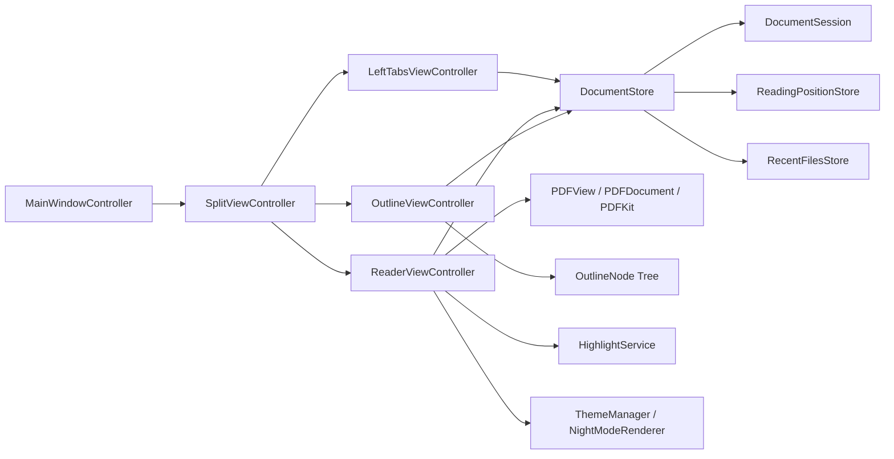

# PDF Reader for macOS

## 1. 项目概述


一个面向 macOS 的极简 PDF 阅读器：支持在“左侧垂直文档标签”和“标题栏水平标签”两种 tab 形态之间自由切换；右侧为目录 sidebar，中间为沉浸式 PDF 阅读区，支持高亮与夜间模式，整体强调极简、扁平、紧凑的布局风格。


### 1.4 产品原则

1. 左边只解决“我正在看哪些文档”。
2. 右边只解决“当前文档的结构是什么”。
3. 中间只解决“阅读本身”。
4. tab 形态必须可切换，垂直模式和水平模式共享同一套文档模型与状态。
5. 水平 tab 模式优先复用 macOS 标题栏区域，不额外占据独立内容高度。
6. 视觉风格明确采用极简、扁平、紧凑布局，避免厚重装饰、强阴影和松散间距。
7. 高频操作优先键盘驱动，交互尽量短路径、低心智负担。
8. 第一版不追求全功能，只追求结构清晰、体验成立。
9. 不引入 fallback、兜底逻辑或不必要兼容层，保持实现简洁。

## 2. 范围定义

### 2.1 V1 范围内

| 模块 | 包含内容 |
|---|---|
| 文档管理 | 打开多个 PDF、tab 切换、关闭 tab、恢复会话、tab 方向切换 |
| 阅读器 | PDF 显示、滚动、适应宽度、单页/双页显示模式切换 |
| 目录 | 解析并展示 PDF outline，支持点击跳转 |
| 状态恢复 | 最近文件、恢复上次打开文档、记住每个文档阅读位置与显示模式 |
| 搜索 | 当前文档文本搜索 |
| 批注 | 文本高亮、删除高亮、保存批注、默认轻粉色高亮、脏状态后手动保存 |
| 主题 | UI 深色主题、基础夜间阅读模式、反色切换 |
| 快捷键 | `a` 进入或执行高亮、`Esc` 退出高亮模式、`i` 切换夜间模式、`Cmd+S` 保存批注、可配置文档/布局快捷键 |
| 保存策略 | 默认 10 分钟自动保存，可切换为永不自动保存 |
| 设置 | 原生设置窗口，支持默认阅读模式、打开时适应宽度、批注自动保存策略 |
| 窗口体验 | 三栏布局、左右栏显隐、压缩标题栏、减少顶部控件、标题栏水平 tab |

### 2.2 V1 明确不做

| 不做项 | 原因 |
|---|---|
| 自研 PDF 渲染器 | 直接使用 PDFKit，避免无谓复杂度 |
| 文件树 / Finder 式侧边栏 | 左栏只做 tab，不做资源管理器 |
| 缩略图面板 | 初版先不分散左栏职责 |
| 云同步 | 非核心路径，拖重产品 |
| 书签库 / 知识库 | 超出阅读器第一版边界 |
| 完美夜间模式 | 成本高，先做够用版本 |
| 复杂微动效 | 优先性能和阅读流畅度 |

## 3. 技术方案

### 3.1 技术选型

| 层级 | 选择 | 原因 |
|---|---|---|
| 语言 | `Swift` | 原生 macOS 开发首选 |
| UI 框架 | `AppKit` | 更适合窗口、分栏、sidebar、标题栏压缩等桌面能力 |
| PDF 能力 | `PDFKit` | 已有 `PDFView`、`PDFDocument`、选择、搜索、批注能力 |
| 目录树 | `NSOutlineView` | 原生层级结构控件，适合 PDF outline |
| 布局容器 | `NSSplitViewController` | 天然适合左-中-右三栏 |
| 窗口样式 | `NSWindow.ToolbarStyle.unifiedCompact` | 压缩头部空间，突出内容 |

### 3.2 为什么不以 SwiftUI 为主

可以在后期用 SwiftUI 包设置页或轻量面板，但主阅读窗口优先用 AppKit。原因很直接：这个项目最核心的是窗口、分栏、标题栏、sidebar 这些桌面级布局与交互控制，而不是声明式 UI 的表达方式。

### 3.3 总体架构



### 3.4 关键设计决策

| 决策 | 结论 |
|---|---|
| 多文档管理 | 采用 `DocumentStore` 持有多个 `DocumentSession` |
| tab 展示模式 | 支持 `verticalSidebar` 与 `horizontalTitlebar` 两种模式动态切换 |
| 当前文档切换 | tab 视图只负责切换 active session，不持有文档状态 |
| PDF 承载方式 | 中间单个 `ReaderViewController` 根据 active session 切换文档 |
| 目录来源 | 从当前 `PDFDocument` 提取 outline，映射为 `OutlineNode` |
| 批注存储 | 高亮先只进入内存与脏状态，按 `Cmd+S` 时覆盖写回源 PDF |
| 自动保存 | 提供自动保存策略，默认 `10 min`，允许设为 `never` |
| 夜间模式 | V1 先做基础版，不深挖自定义渲染管线 |
| 状态恢复 | 每个 session 持有阅读状态，持久化到 store |

## 4. 信息架构与界面结构

### 4.1 可切换 Tab 结构

| 区域 | 职责 | 设计边界 |
|---|---|---|
| 左栏 Vertical Tabs | 在垂直模式下显示已打开 PDF，负责切换 | 不放目录，不放文件树，不放缩略图 |
| 标题栏 Horizontal Tabs | 在水平模式下承载已打开 PDF 的 tab strip | 使用标题栏区域，不额外新增一行内容区 tab |
| 中栏 Reader | 负责 PDF 阅读体验 | 显示、滚动、缩放、选择、搜索、批注 |
| 右栏 Outline Sidebar | 显示当前 PDF 目录树 | 只服务当前文档 |

### 4.2 窗口策略

1. 主窗口使用 `NSSplitViewController`。
2. tab 展示模式支持在“左侧垂直”与“标题栏水平”之间切换。
3. 垂直模式下左侧栏承担文档 tab；水平模式下左侧栏默认可收起，仅保留右侧目录与中间阅读区。
4. 左右侧栏支持折叠和显隐。
5. 中间阅读区自适应扩展。
6. 分栏位置需设置合理约束，避免侧栏被拖到失衡。
7. 标题栏和 toolbar 尽量压缩，保留必要入口即可。

### 4.3 视觉风格规范

| 维度 | 要求 |
|---|---|
| 整体气质 | 极简、扁平、紧凑，避免“功能堆叠感” |
| 间距 | 优先紧凑布局，减少无意义留白，但保持点击与阅读舒适度 |
| 形态 | 尽量使用清晰矩形与轻量圆角，不依赖拟物装饰 |
| 阴影 | 弱化或避免厚重阴影，更多依靠层级、边线和底色区分 |
| 颜色 | 克制、低噪音，以内容为中心，不让 UI 抢夺注意力 |
| 控件 | 按钮和 tab 视觉重量尽量轻，突出当前选中态即可 |
| 标题栏 | 在水平 tab 模式下应尽量与系统标题栏融为一体 |
| 侧栏整合 | 禁止悬浮、液态玻璃或漂浮面板感；左右侧栏必须与窗口内容区平铺嵌入，最多保留一条很淡的分割线 |
| 高亮颜色 | 默认高亮色采用偏轻、低饱和但清晰可辨的粉色 |
| 批注保存 | 默认不即时落盘，高亮后先进入未保存状态，由 `Cmd+S` 或自动保存策略触发写回 |

### 4.4 关键交互约定

| 交互 | 约定 |
|---|---|
| `a` | 若当前已有文本选区，则立即以默认轻粉色创建高亮 |
| `a` | 若当前没有选区，则进入“高亮模式”，此后选中文字即自动高亮 |
| `Esc` | 退出高亮模式 |
| `i` | 切换反色夜间模式 |
| `Cmd+S` | 将当前文档未保存批注写回源 PDF |

### 4.5 批注保存策略

| 项目 | 约定 |
|---|---|
| 默认行为 | 创建、删除高亮后只更新当前 session 与脏状态，不立即写回文件 |
| 手动保存 | 用户按 `Cmd+S` 时，将当前文档未保存批注覆盖写回源 PDF |
| 关闭/退出保护 | 关闭 dirty tab 或退出 app 时，必须提示 `Save / Cancel / Discard` |
| 自动保存默认值 | `10 min` |
| 自动保存选项 | 至少支持 `10 min`、`never` |
| 自动保存失败 | 需要显式提示失败文档，不能只写日志 |
| UI 状态 | 当前文档有未保存批注时，tab 或窗口状态应有轻量提示 |

## 5. 数据模型

### 5.1 核心对象：`DocumentSession`

表示一个打开的 PDF tab。

| 字段 | 类型建议 | 说明 |
|---|---|---|
| `id` | `UUID` | session 唯一标识 |
| `url` | `URL` | PDF 文件位置 |
| `title` | `String` | 文档标题或文件名 |
| `pdfDocument` | `PDFDocument` | 当前文档对象 |
| `currentPageIndex` | `Int` | 当前页索引 |
| `displayMode` | `ReaderDisplayMode` | 当前阅读显示模式 |
| `scaleMode` | `ReaderScaleMode` | 当前是手动缩放还是适应宽度 |
| `zoomScale` | `CGFloat` | 当前缩放比例 |
| `lastReadPosition` | 自定义结构 | 页码 + 页面内位置 |
| `outlineTree` | `[OutlineNode]` | 目录树 |
| `isDirty` | `Bool` | 是否有未保存的批注变更 |
| `sidebarState` | 自定义结构 | 左右侧栏显隐状态 |
| `tabPresentationState` | 自定义结构 | 当前 tab 展示模式下的局部状态 |
| `annotationSavePolicy` | 自定义结构 | 当前批注保存策略，如 `10 min` 或 `never` |

### 5.2 核心对象：`DocumentStore`

负责整个 app 的文档生命周期管理。

| 职责 | 说明 |
|---|---|
| 管理已打开 sessions | 新建、插入、关闭、排序 |
| 维护当前激活 session | 左栏 tab 与中间 reader 联动 |
| 恢复上次会话 | 启动时重建已打开文档 |
| 持久化阅读状态 | 保存页码、缩放、滚动位置、显示模式 |
| 管理最近文件 | 提供 reopen 入口 |

### 5.3 辅助模型

| 模型 | 用途 |
|---|---|
| `ReaderState` | 阅读区当前 UI 状态 |
| `OutlineNode` | 目录树节点 |
| `ReadingPosition` | 记录页码与定位信息 |
| `ThemeState` | 主题与夜间模式状态 |
| `TabPresentationMode` | `verticalSidebar` / `horizontalTitlebar` |
| `AnnotationSavePolicy` | 批注保存策略，如 `after10Minutes` / `never` |

## 6. 项目结构

```text
App/
  AppDelegate.swift
  MainWindowController.swift
  SplitViewController.swift

Core/
  DocumentSession.swift
  DocumentStore.swift
  ReaderState.swift
  ReadingPosition.swift

UI/LeftTabs/
  VerticalTabsViewController.swift
  VerticalTabsItemView.swift

UI/TitlebarTabs/
  TitlebarTabsController.swift
  TitlebarTabItemView.swift

UI/CenterReader/
  ReaderViewController.swift
  PDFContainerView.swift
  ReaderShortcutsController.swift

UI/RightOutline/
  OutlineViewController.swift
  OutlineNode.swift

Features/Annotations/
  HighlightService.swift

Features/Theme/
  ThemeManager.swift
  NightModeRenderer.swift

Features/Persistence/
  RecentFilesStore.swift
  ReadingPositionStore.swift
  SessionRestoreStore.swift

Tests/
  Core/
  Features/
```

## 7. 里程碑计划

### 7.1 Milestone 1: MVP 骨架

目标：让应用成为一个真的能打开并切换多个 PDF 的阅读器。

#### 交付物

1. 三栏主窗口。
2. 中间 `PDFView`。
3. 可切换的 tab 承载层。
4. 右侧 outline 展示。
5. 打开文件与基础会话恢复。

#### 任务拆分

| 编号 | 任务 | 说明 |
|---|---|---|
| M1-1 | 创建 AppKit 工程骨架 | 主窗口、split view、controller 层级 |
| M1-2 | 接入 `PDFKit` | reader 中嵌入 `PDFView` |
| M1-3 | 设计 `DocumentSession` / `DocumentStore` | 多文档管理核心 |
| M1-4 | 实现 `Command+O` 打开文件 | 打开后加入 tab 列表 |
| M1-5 | 实现 tab 展示模式切换 | 垂直 sidebar / 标题栏水平 tab |
| M1-6 | 实现 tab 切换 | 激活不同 session |
| M1-7 | 解析并展示 outline | 无目录时显示空状态 |
| M1-8 | 实现左右栏显隐 | 保持中间阅读区自适应 |
| M1-9 | 启动时恢复打开文档列表 | 至少恢复文件集合与 active 文档 |

#### 验收标准

| 编号 | 标准 |
|---|---|
| AC-M1-1 | 可以连续打开多个 PDF |
| AC-M1-2 | 垂直 tab 与水平标题栏 tab 可自由切换 |
| AC-M1-3 | 两种 tab 模式下都可以稳定切换当前文档 |
| AC-M1-4 | 右侧目录跟随当前文档更新 |
| AC-M1-5 | 无 outline 的 PDF 会显示明确空状态 |
| AC-M1-6 | 左右侧栏可隐藏且不破坏阅读区布局 |
| AC-M1-7 | 重启应用后可恢复上次打开文档列表与 tab 模式 |

### 7.2 Milestone 2: 阅读体验

目标：从“能用”提升到“顺手”。

#### 交付物

1. 阅读配置文件、适应宽度与单双页显示模式。
2. 当前文档搜索（当前为菜单触发并定位首个命中）。
3. 最近文件（当前通过 `File > Open Recent` 提供 reopen）。
4. 阅读位置恢复。
5. 更顺手的快捷键。
6. 高亮模式键盘流。

#### 任务拆分

| 编号 | 任务 | 说明 |
|---|---|---|
| M2-1 | 阅读配置文件 | 用 `.toml` 管理默认阅读模式与快捷键 |
| M2-2 | 阅读显示模式 | 支持单页、单页连续、双页、双页连续 |
| M2-3 | 文本搜索 | 基于 `PDFDocument` / `PDFSelection` 能力 |
| M2-4 | 最近文件列表 | 记录最近打开项 |
| M2-5 | 阅读位置持久化 | 页码、缩放、滚动位置、显示模式 |
| M2-6 | 上次会话恢复增强 | 恢复 active 文档与定位 |
| M2-7 | 快捷键系统 | 落实 `a` / `Esc` / `i` 等阅读快捷键 |

#### 验收标准

| 编号 | 标准 |
|---|---|
| AC-M2-1 | 同一文档重新打开后能恢复到之前阅读位置 |
| AC-M2-2 | 不同 tab 间切换时阅读状态互不污染 |
| AC-M2-2a | 默认阅读模式来自配置文件，默认值为单页连续 |
| AC-M2-2b | 适应宽度与四种显示模式都有快捷键入口 |
| AC-M2-3 | 搜索结果可定位到文档具体位置 |
| AC-M2-4 | 最近文件可用来重新打开历史 PDF |
| AC-M2-5 | `i` 可稳定切换夜间模式，`Esc` 可退出高亮模式 |

#### 默认快捷键方案

- 配置文件路径：`~/Library/Application Support/SlatePDF/config.toml`
- `Cmd+B`：切换左侧边栏
- `Cmd+Option+B`：切换右侧边栏
- `Cmd+Shift+1`：切换到垂直 sidebar tabs
- `Cmd+Shift+2`：切换到水平 titlebar tabs
- `Cmd+W`：关闭当前标签页
- `Cmd+Shift+[` / `Cmd+Shift+]`：切换到上一个 / 下一个标签页
- `Cmd+0`：适应宽度
- `Cmd+1` / `Cmd+2` / `Cmd+3` / `Cmd+4`：切换 `singlePage` / `singlePageContinuous` / `twoUp` / `twoUpContinuous`

### 7.3 Milestone 3: 高亮与批注

目标：让产品进入长期可用状态。

#### 交付物

1. 文本选择高亮。
2. 固定颜色高亮菜单。
3. 删除高亮。
4. 批注保存。
5. 默认轻粉色高亮与键盘高亮流。
6. 手动保存与自动保存策略。

#### 任务拆分

| 编号 | 任务 | 说明 |
|---|---|---|
| M3-1 | 选择文本并创建高亮 annotation | 基于 `PDFSelection` + `PDFAnnotation` |
| M3-2 | 默认高亮色 | 默认使用偏轻、低饱和、清晰的粉色 |
| M3-3 | 提供固定色板 | 黄色、绿色、粉色即可，默认选中粉色 |
| M3-4 | 键盘高亮流 | `a` 立即高亮或进入高亮模式，`Esc` 退出 |
| M3-5 | 删除已有高亮 | 支持选中后删除 |
| M3-6 | 手动保存策略 | 高亮后不立即落盘，`Cmd+S` 时覆盖写回源 PDF |
| M3-7 | 自动保存策略 | 默认 `10 min`，允许设为 `never` |
| M3-8 | 脏状态管理 | tab 中展示未保存状态 |

#### 验收标准

| 编号 | 标准 |
|---|---|
| AC-M3-1 | 默认高亮色符合“偏轻粉色、低饱和但清晰”的要求 |
| AC-M3-2 | 选中文字后按 `a` 可以稳定添加高亮 |
| AC-M3-3 | 无选区时按 `a` 进入高亮模式，之后选中文字即自动高亮 |
| AC-M3-4 | 按 `Esc` 可以退出高亮模式 |
| AC-M3-5 | 已有高亮可以删除 |
| AC-M3-6 | 高亮后文档进入未保存状态，但不会立即覆盖源文件 |
| AC-M3-7 | 按 `Cmd+S` 后当前文档批注被写回源 PDF |
| AC-M3-8 | 自动保存默认值为 `10 min`，并允许设置为 `never` |
| AC-M3-9 | 保存后重新打开 PDF，高亮仍存在 |

### 7.4 Milestone 4: 夜间模式与窗口打磨

目标：从“工具”提升到“舒服、愿意常开”。

#### 交付物

1. UI 深色主题。
2. 基础夜间阅读模式与反色切换。
3. 压缩标题栏与 toolbar。
4. 优化分栏、边距与留白。
5. 统一极简扁平紧凑视觉语言。

#### 任务拆分

| 编号 | 任务 | 说明 |
|---|---|---|
| M4-1 | ThemeManager | 统一主题状态入口 |
| M4-2 | 夜间模式基础版 | 背景变深、页边暗化、UI 跟随深色 |
| M4-3 | 反色切换交互 | `i` 触发阅读区反色夜间模式切换 |
| M4-4 | 扫描 PDF 最小兼容方案 | 降亮度或温和处理 |
| M4-5 | 标题栏压缩 | `unifiedCompact` 与最小 toolbar，兼容水平 tab 模式 |
| M4-6 | 视觉细节打磨 | 边距、拖动体验、选中态、hover 态 |
| M4-7 | 极简视觉统一 | 扁平化、紧凑布局、控件减重 |

#### 验收标准

| 编号 | 标准 |
|---|---|
| AC-M4-1 | 深色模式下 UI 整体风格统一 |
| AC-M4-2 | `i` 可即时切换夜间模式，切换后状态正确同步 |
| AC-M4-3 | 夜间模式下文本 PDF 可读，不明显刺眼 |
| AC-M4-4 | 顶部空间占用显著低于常规文档应用 |
| AC-M4-5 | 整体视觉符合极简、扁平、紧凑目标，不出现厚重装饰感 |

### 7.5 Milestone 5: 收口、设置与发布前稳固

目标：把已经完成的主路径真正收成“可以放心常用”的桌面应用。

#### 交付物

1. 一轮基于真实 PDF 的完整 UAT。
2. 针对 UAT 暴露问题的稳定性修复与回归测试。
3. 最小设置窗口，至少覆盖阅读默认项和批注自动保存策略。
4. 文档与行为同步，方便后续继续迭代或发布。

#### 任务拆分

| 编号 | 任务 | 说明 |
|---|---|---|
| M5-1 | 真实 PDF 手测 | 使用 `~/Downloads` 中真实 PDF 跑完整主路径 |
| M5-2 | UAT 问题收敛 | 只修阻断使用、明显困扰或高频路径问题 |
| M5-3 | 稳定性回归测试 | 为修复点补最小单测或集成测试 |
| M5-4 | 最小设置窗口 | 提供默认阅读模式、打开时适应宽度、自动保存策略入口 |
| M5-5 | 设置持久化闭环 | 设置修改后立即写回配置文件，并影响新会话 |
| M5-6 | 发布前清理 | 同步文档、收口临时行为与说明 |

#### 验收标准

| 编号 | 标准 |
|---|---|
| AC-M5-1 | `UAT-01` 到 `UAT-10` 在真实 PDF 上完成并记录结论 |
| AC-M5-2 | UAT 中发现的关键问题已修复，且有对应回归验证 |
| AC-M5-3 | 设置窗口可稳定修改默认阅读模式、打开时适应宽度、自动保存策略 |
| AC-M5-4 | 设置写回 `~/Library/Application Support/SlatePDF/config.toml`，重启后仍生效 |
| AC-M5-5 | 全部自动化测试通过，手测主路径无阻断问题 |

### 7.6 Milestone 6: 体验打磨与快捷键补齐

目标：在 M1–M5 的能力上，补齐日常使用中暴露的手感缺口 —— 快捷键可见性、高亮删除顺手度、文档全局感（缩略图 / 全览）、窗口标题栏整洁度、阅读时的位置感。

#### 交付物

1. 菜单上完整显示所有 plain 快捷键（`A`、`I`、`D`、`Esc`）。
2. 新的删除高亮交互：无需 select，光标或鼠标悬停在高亮处按 `D` 即可删除。
3. 左侧缩略图模式（替代 / 切换自 tab 列表的"第二视图"）。
4. 全览模式：一屏平铺所有页面的 grid thumbnail 视图。
5. `Cmd+Shift+T` 重新打开上次关闭的文件。
6. 清理窗口标题栏（去掉和红绿灯重叠的 "Documents" 文字）。
7. 右侧 Outline 栏底部页码状态栏（形如 `1 / 35`）。
8. 页面跳转（`Cmd+Option+G`）、Vim 式 `J` / `K` 翻页、PDF 内链接点击跳转、`Cmd+[` / `Cmd+]` 历史前进 / 后退。
9. 小范围延伸：dirty 点、Find bar 非模态化、缩放快捷键。

#### 任务拆分

| 编号 | 任务 | 说明 |
|---|---|---|
| M6-1 | plain 快捷键菜单可见性 | 把 `A` / `I` / `D` / `Esc` 作为无修饰 `keyEquivalent` 写入菜单项，macOS 即可渲染出快捷键符号 |
| M6-2 | 高亮删除改为 `D` + 命中检测 | `removeHighlight` 快捷键切 plain `d`；命中点取自 `pdfView` 当前鼠标位置（`NSWindow.mouseLocationOutsideOfEventStream`），找到最近的 `Highlight` annotation 删除；若有选区仍走当前逻辑 |
| M6-3 | 左栏缩略图模式 | 在 `VerticalTabsViewController` 旁新增 `ThumbnailsViewController`（`PDFThumbnailView` 纵向单列）；左栏顶部加一个 `segmented control`：Tabs / Thumbnails |
| M6-4 | 全览（grid）模式 | 新增 `AllPagesOverviewController`：Reader 区临时替换为 `PDFThumbnailView` grid；按快捷键进入，按 `Esc` 退出；建议快捷键 `Cmd+Shift+P`（Preview） |
| M6-5 | 重开上次关闭的文件 | `DocumentStore` 维护 `recentlyClosedStack: [URL]`；`close(sessionID:)` 推栈；新命令 `ShortcutCommand.reopenLastClosed` + `Cmd+Shift+T` pop-and-open |
| M6-6 | 清理窗口标题栏 | `window.title` 持续置空或仅用在 menu bar；`titlebarTabsItem.label` / `paletteLabel` 清空；必要时验证 vertical 模式下系统不会再补自动标题 |
| M6-7 | Outline 底部页码状态栏 | `OutlineViewController` 在底部加 `NSTextField`，监听 `documentStoreDidChange` + `PDFViewPageChanged`，显示 `currentPage / totalPages` |
| M6-8 | Tab dirty 指示 | 垂直 tab / 水平 titlebar tab 上给 `isDirty == true` 的 session 加一个小圆点 |
| M6-9 | Find 非模态化 | `Cmd+F` 打开内嵌 find bar；`Cmd+G` / `Cmd+Shift+G` 遍历匹配；`Esc` 收起 |
| M6-10 | 跳转到页 N | `Cmd+Option+G` 输入页码跳转；失败时轻量提示 |
| M6-11 | 缩放快捷键 | `Cmd+=` 放大、`Cmd+-` 缩小；退出 `fitWidth` 状态保持为 `manual` |
| M6-12 | Vim 式翻页 `J` / `K` | plain `J` = 下一页，`K` = 上一页；遵循当前 displayMode（连续模式下等同 `pdfView.goToNextPage` / `goToPreviousPage`） |
| M6-13 | PDF 内链接点击跳转 | 确认 `PDFView` 接管 `Link` annotation 点击；内部跳转走 `go(to:)` 并推入历史栈；外部 URL 用系统默认打开 |
| M6-14 | 历史前进 / 后退 | `Cmd+[` 后退、`Cmd+]` 前进；走 `PDFView.goBack()` / `goForward()` 并尊重跨页跳转（outline 点击、链接点击、`Cmd+Option+G`、`Cmd+Shift+T` 也应入栈） |
| M6-15 | 文档同步 | 同步 `PROJECT.md` / `TASKS.md` 的新交互、默认快捷键方案、配置文件字段 |

#### 默认快捷键方案（M6 新增 / 调整）

- `A`：高亮选区或进入高亮模式（保持不变，但菜单必须可见）
- `Esc`：退出高亮模式 / 关闭全览 / 关闭 Find bar
- `I`：切换夜间模式（保持不变，但菜单必须可见）
- `D`：删除当前光标所在位置的高亮（从 `Cmd+Shift+D` 迁移，作为 plain 快捷键）
- `Cmd+Shift+T`：重新打开上次关闭的文件
- `Cmd+Shift+P`：进入 / 退出全览模式
- `Cmd+Shift+L`：切换左栏 Tabs / Thumbnails 模式（可选，也可以仅点击 segmented control）
- `Cmd+F` / `Cmd+G` / `Cmd+Shift+G`：Find bar + 下一 / 上一 匹配
- `Cmd+Option+G`：跳转到指定页
- `J` / `K`：下一页 / 上一页（Vim 式，plain 快捷键，文本输入上下文让路）
- `Cmd+[` / `Cmd+]`：历史后退 / 前进（跨页跳转历史）
- `Cmd+=` / `Cmd+-`：放大 / 缩小

#### 验收标准

| 编号 | 标准 |
|---|---|
| AC-M6-1 | Annotate / View 菜单中 `A`、`I`、`Esc`、`D` 快捷键在文字旁清晰可见 |
| AC-M6-2 | 不需要先选中高亮，光标位于高亮上时按 `D` 即可删除；原 `Cmd+Shift+D` 不保留 |
| AC-M6-3 | 左栏可在 Tabs / Thumbnails 之间切换，Thumbnails 单列垂直滚动；点击缩略图跳转当前文档对应页 |
| AC-M6-4 | 全览模式下所有页面以 grid 形式铺开；点击某页进入该页；`Esc` 可退出 |
| AC-M6-5 | `Cmd+Shift+T` 能连续恢复最近关闭的 1–N 个文件（只要未清空栈） |
| AC-M6-6 | 任一 tab 模式下窗口顶栏不再出现 "Documents" 文字，不与交通灯重叠 |
| AC-M6-7 | 右侧 Outline 栏底部始终显示当前文档的 `当前页 / 总页数`；文档关闭时隐藏或显示 `—` |
| AC-M6-8 | 含未保存变更的 tab 视觉上可区分（dirty 点） |
| AC-M6-9 | `Cmd+F` 走非模态 find bar，支持多匹配循环 |
| AC-M6-10 | `Cmd+Option+G` 输入页码可跳转；越界输入给出轻量提示 |
| AC-M6-11 | `Cmd+=` / `Cmd+-` 平滑缩放，且保持缩放状态在 session 中持久化 |
| AC-M6-12 | `J` / `K` 稳定地前进 / 后退一页，且不干扰文本输入上下文 |
| AC-M6-13 | PDF 内链接点击能跳转到目标页或目标 URL；跳转后 `Cmd+[` 可回到起跳位置 |
| AC-M6-14 | `Cmd+[` / `Cmd+]` 能在至少 10 步跨页历史中稳定前进 / 后退 |

### 7.7 Milestone 7: 搜索强化与对比阅读

目标：把搜索从"能找到"升级为"能扫视所有命中"，并支持"同时看两份 PDF 做对比"这个日常阅读中最常缺位的能力。

#### 交付物

1. 搜索结果面板：当前文档内所有匹配项，按页分组，列表可点击跳转。
2. 跨文档搜索（可选）：在所有已打开 session 中搜索同一关键词。
3. 同窗分屏：主窗口可切换为"双 Reader"模式，两侧各承载一个 `DocumentSession`，共享 `DocumentStore`。
4. 多窗口对比：支持"新建窗口"承载独立的 Reader 视图；多个窗口共享 session 列表但各自有 active session。

#### 任务拆分

| 编号 | 任务 | 说明 |
|---|---|---|
| M7-1 | 搜索结果面板视图 | 非模态 find bar 下挂一个可折叠 list，按 page 分组显示 `snippet` + 页码；点击跳转并入历史栈 |
| M7-2 | 搜索模型 | 把 `findString` 的全部结果缓存在当前 session 的临时搜索状态中；切换文档或关闭 bar 时清空 |
| M7-3 | 跨文档搜索（可选） | find bar 顶部一个 toggle："This Document" / "All Open"；命中项在列表里带文档名 |
| M7-4 | 分屏 Reader | `SplitViewController` 中栏下层再拆为双 Reader，按 `Cmd+Ctrl+\` 切换进入 / 退出；每个 Reader 持有独立的 active session id |
| M7-5 | 多窗口 | 新命令 `File > New Window`（`Cmd+Shift+N`）；`MainWindowController` 支持多实例；`DocumentStore` 保持单例但公开多窗口 active session 接口 |
| M7-6 | 跨窗口拖拽 | 可选：把 vertical tab 拖进另一窗口，把 session 在两个窗口的 active 状态间迁移 |
| M7-7 | 状态持久化 | 分屏与多窗口的布局在重启后恢复（可降级为默认单窗口） |
| M7-8 | 文档同步 | 更新 `PROJECT.md` / `TASKS.md` / `config.toml` 默认值 |

#### 默认快捷键方案（M7 新增）

- `Cmd+Ctrl+\`：切换同窗分屏
- `Cmd+Shift+N`：新建窗口
- find bar 内 `↑` / `↓`：在结果列表中移动；`Enter` 跳转

#### 验收标准

| 编号 | 标准 |
|---|---|
| AC-M7-1 | 非模态 find bar 下可看到当前文档的全部匹配项列表，点击跳转，历史栈更新 |
| AC-M7-2 | 在至少 200 页的 PDF 上搜索常见词，UI 不卡顿 |
| AC-M7-3 | 同窗分屏可稳定进入 / 退出，两侧独立切换 session，状态互不污染 |
| AC-M7-4 | 多窗口下关闭任一窗口不影响其他窗口的 session；`Cmd+Shift+T` 行为保持合理 |
| AC-M7-5 | 重启后能恢复最后一次的分屏或多窗口布局（或明确降级说明） |

### 7.8 Milestone 8: 批注深度化

目标：把"标高亮 + 保存"的基础批注能力，扩展为"可查看、可导出、可按自己的习惯配置"的批注工作流。

#### 交付物

1. 批注管理器：右栏新增"Annotations"模式，与 Outline 并列，列出当前文档所有高亮。
2. 批注导出：高亮可导出为 Markdown / 纯文本 / JSON，目标为剪贴板或磁盘文件。
3. 自定义快捷键 UI：设置窗口新增 Shortcuts 面板，在 GUI 中捕获并写回 `config.toml`。

#### 任务拆分

| 编号 | 任务 | 说明 |
|---|---|---|
| M8-1 | 批注模型扩展 | 为每个 highlight 抽取 `snippet`（选中文本）、`pageIndex`、`createdAt`（若可从 PDF 获取）、`color` |
| M8-2 | 右栏 Annotations 模式 | 右栏顶部 segmented control：Outline / Annotations；列表按页分组，点击跳转 |
| M8-3 | 批注跳转 | 点击列表项高亮对应 annotation 并滚动到位 |
| M8-4 | 导出 Markdown / Plain / JSON | 命令 `File > Export Highlights…`；格式可选；JSON 结构化最稳，Markdown 适合知识管理工具 |
| M8-5 | 剪贴板 / 文件双目标 | `Cmd+Shift+E` 复制到剪贴板；显式 "Save as…" 走 `NSSavePanel` |
| M8-6 | 自定义快捷键 UI | 设置窗口新增 Shortcuts 面板，用 `NSTextField` 或自定义 key-capture 控件捕获绑定；保存时写回 `config.toml` 并 `updateAppConfiguration` |
| M8-7 | 冲突检测 | 改绑定时检测同键冲突，阻止或提示 |
| M8-8 | 文档同步 | 同步 docs、示例 `config.toml`、设置截图（若需要） |

#### 默认快捷键方案（M8 新增）

- `Cmd+Shift+A`：切换右栏 Outline / Annotations
- `Cmd+Shift+E`：导出当前文档高亮到剪贴板（默认 Markdown）

#### 验收标准

| 编号 | 标准 |
|---|---|
| AC-M8-1 | Annotations 面板显示当前文档所有高亮，按页分组，支持点击跳转 |
| AC-M8-2 | 导出文件格式覆盖 Markdown / 纯文本 / JSON，内容包含 `snippet`、页码、颜色 |
| AC-M8-3 | 自定义快捷键 UI 改动可写回 `config.toml` 并在新会话生效 |
| AC-M8-4 | 冲突绑定被拒绝或显式提示，不会覆盖破坏原有命令 |

### 7.9 Milestone 9（长期预研）: 扩展生态

目标：在核心阅读体验稳定后，预研 SlatePDF 的扩展机制，为导出、外接脚本、过滤器、主题等二次开发场景留出口子。本里程碑先产出**设计决策 + 最小可跑示例**，不承诺全量实现。

#### 交付物

1. 扩展机制设计决策（Design Doc）：候选路径比较（进程内 Swift 插件 / URL scheme / 外部 CLI 调用 / WebKit 插件壳 / 其他）。
2. 最小可跑示例：以 M8 "导出高亮" 为首个插件化用例，验证机制。
3. Slate Extension API 草稿（若决策继续）。

#### 任务拆分（只做规划，不立 ticket 到具体实现）

| 编号 | 任务 | 说明 |
|---|---|---|
| M9-1 | 扩展机制 RFC | 分析 PDF 阅读器常见扩展场景，列选型利弊；给结论 |
| M9-2 | PoC 实现 | 选一条路径，把"导出高亮"作为首个插件化用例验证 |
| M9-3 | API 草稿 | 若 PoC 成立，草拟稳定 API 面向后续扩展开发者 |
| M9-4 | 风险评估 | 安全、沙箱、兼容性、上架审核（若上 MAS）的影响 |

#### 验收标准

| 编号 | 标准 |
|---|---|
| AC-M9-1 | 有一份 `docs/extensions-rfc.md` 给出决策与理由 |
| AC-M9-2 | 至少一个 PoC 扩展能在当前 app 中运行 |
| AC-M9-3 | 若决策推迟，至少把"为什么现在不做"写清楚，避免后续重复讨论 |

## 8. 开发顺序建议

按最短闭环推进：

1. 三栏主窗口。
2. 中间 `PDFView`。
3. tab 展示模式与切换。
4. 右侧目录树。
5. 会话恢复与阅读状态。
6. 搜索、翻页、缩放。
7. 高亮与保存。
8. 夜间模式。
9. 窗口与视觉打磨。
10. UAT 收口与最小设置入口。

原因：先确保信息架构和主路径成立，再做增强体验，最后做“舒服感”。

## 9. 测试策略

### 9.1 测试原则

1. 核心状态管理必须有测试。
2. UI 复杂交互不强求全自动化，但关键路径至少手测清单覆盖。
3. 优先测试 `Core` 和 `Persistence`，其次测试 features。

### 9.2 自动化测试建议

| 模块 | 测试类型 | 重点 |
|---|---|---|
| `DocumentStore` | Unit Test | 打开、关闭、切换、恢复逻辑 |
| `AppConfigurationStore` | Unit Test | `.toml` 配置创建与读取 |
| `ReadingStateStore` | Unit Test | 状态持久化读写 |
| `RecentFilesStore` | Unit Test | 最近文件去重与排序 |
| `HighlightService` | Unit Test / 集成测试 | annotation 创建与删除 |

### 9.3 手动验收清单

| 编号 | 检查项 |
|---|---|
| UAT-1 | 连续打开 3 个 PDF 并来回切换无错乱 |
| UAT-2 | 每个 PDF 的目录正确更新 |
| UAT-3 | 文档关闭后 active tab 行为正确 |
| UAT-4 | 重启后恢复正确文档与阅读位置 |
| UAT-5 | 选中文字按 `a` 可直接生成默认轻粉色高亮 |
| UAT-6 | 无选区按 `a` 进入高亮模式，`Esc` 退出 |
| UAT-7 | 高亮后未按 `Cmd+S` 时，源文件未被立刻覆盖 |
| UAT-8 | 按 `Cmd+S` 后重新打开 PDF，高亮仍存在 |
| UAT-9 | 自动保存策略默认是 `10 min`，并可切换为 `never` |
| UAT-10 | 按 `i` 可切换夜间模式，普通文本 PDF 与扫描 PDF 都能接受 |

## 10. 风险与规避

| 风险 | 说明 | 策略 |
|---|---|---|
| 夜间模式复杂度高 | `PDFView` 内部视图层级可能限制改造 | V1 先做轻量方案 |
| 多文档状态污染 | 切换 tab 时缩放/页码容易串 | 状态严格挂在 `DocumentSession` 上 |
| 双 tab 模式一致性 | 垂直与水平模式容易出现行为分叉 | 使用统一 `DocumentStore` 和统一切换命令 |
| 批注写回失败 | 手动保存或自动保存时可能因文件权限或 PDF 结构失败 | V1 聚焦常规 PDF，失败显式提示且保留未保存状态 |
| 侧栏职责膨胀 | 很容易把左栏做成文件浏览器 | 严守边界，左栏只做 tab |
| UI 过早打磨 | 会拖慢主路径交付 | 先确保主功能闭环 |

## 11. 第一开发周期任务单

建议把第一轮开发聚焦为 `MVP Skeleton`，只做以下事项：

| 优先级 | 任务 |
|---|---|
| P0 | 建立 AppKit 工程与三栏窗口 |
| P0 | 接入 `PDFView` 并打开本地 PDF |
| P0 | 建立 `DocumentSession` / `DocumentStore` |
| P0 | 实现垂直 tab 与标题栏水平 tab 两种模式 |
| P0 | 右侧 outline 展示与点击跳转 |
| P1 | 左右侧栏显隐 |
| P1 | 恢复上次打开文档列表 |

第一轮结束后，软件应达到“我可以真的用它打开几份 PDF 来回看”的程度。

## 12. 开发约束

1. 先做结构正确，再做视觉精致。
2. 不为未来假设场景预埋复杂抽象。
3. 不写多余兼容层，不引入 fallback 逻辑。
4. 优先使用系统原生能力：`AppKit`、`PDFKit`、`NSOutlineView`、`NSSplitViewController`。
5. 所有后续实现应尽量围绕本文件维护，不要边做边漂移。

## 13. 下一步建议

如果围绕这个计划正式开工，下一步应该直接做下面三件事：

1. 建立 Xcode AppKit 工程骨架。
2. 先实现 `DocumentStore` 和三栏主窗口。
3. 跑通“打开 PDF -> 左侧出现 tab -> 中间显示 -> 右侧出现目录”的第一条闭环。

---

这份 `PROJECT.md` 应作为当前阶段的主项目文档。后续如果进入实际编码阶段，建议再补两份执行文档：

1. `ARCHITECTURE.md`：记录关键类关系、事件流、状态流。
2. `TASKS.md`：拆成可逐项勾选的开发任务列表。
