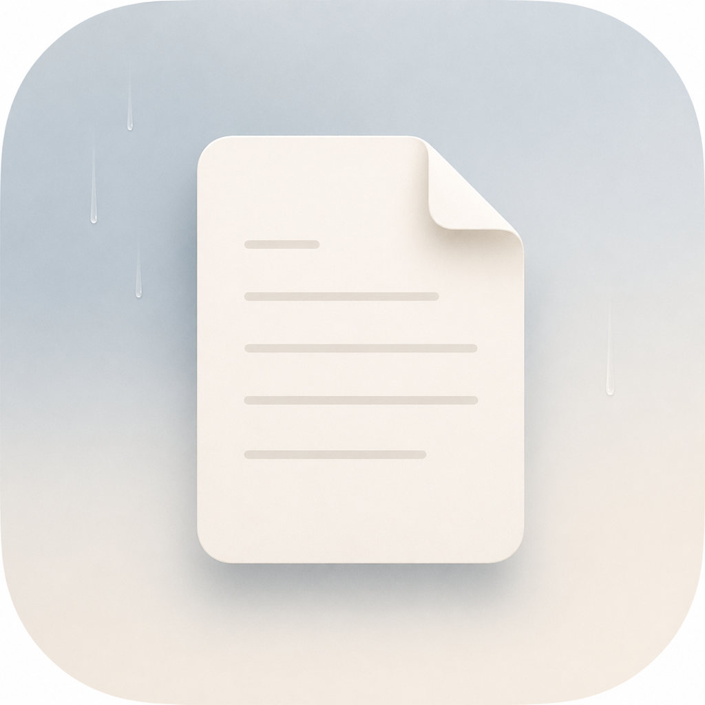

# Serein

<p align="center">
  
</p>

Native macOS PDF reader — Swift + AppKit + PDFKit. Minimal, flat, compact.

Local website preview lives in [Website](Website/). It is a static product
site for showcase, download notes, and compact docs.

## Features

- Tabbed documents with switchable layouts: left vertical sidebar or adaptive titlebar tabs
- Click a starting point, then Shift-click an endpoint to select text, including across pages and from line-boundary whitespace. Further Shift-clicks adjust the endpoint; an ordinary click starts a new selection.
- `cmd+o` supports selecting PDF files and folders; selected folders are scanned for PDFs automatically
- `cmd+t` creates an untitled blank tab for a clean reading workspace; blank tabs are not PDF-backed, recent history entries, or relaunch-restored sessions
- Right pane hosts **Outline + Pages + Search + Annotations**; Annotations is a full-height compact comment feed with inline editing and keyboard navigation, while Outline adds heading filtering, wrapped titles, no horizontal panning, and one-click tree expand/collapse
- When the Outline pane is not active (right sidebar closed, or open on Pages / Search / Annotations), a Notion-style rail of heading marks appears at the reader's right edge; hover expands the full outline as a translucent, theme-tinted overlay sized to its content, long outlines scroll within the configured maximum height, dragging either vertical edge adjusts that limit symmetrically around its center, and PDFs without an outline show no rail
- Right sidebar modes keep a consistent pane footprint, so switching Outline / Pages / Search / Annotations does not visually widen or narrow the sidebar
- Find bar supports `This Document` / `All Open`, match-case `Aa`, and whole-word `Word`; opening it with selected PDF text searches that text immediately, `All Open` scopes to PDFs open in the current window, typing alone does not search, first `enter` submits, repeated `enter` / `cmd+g` / `cmd+shift+g` continue match navigation
- Reader navigation keeps the compact Vim-style layer: `c` toggles continuity within the current Single Page, Two-Up, or Book layout, `j` / `k` page turns, `ctrl+d` / `ctrl+u` half-page scroll, and `g` / `shift+g` jump to the real document edges; Book modes also accept `h` / `←` and `l` / `→` for previous / next spread; `cmd+[` / `cmd+]` restore exact pane-local positions across same-page and cross-document Outline, Pages, link, Search, and annotation jumps; clicking an internal link previews the destination in place, while Option-click jumps and stays centered
- Cursor reading focus (`f`) dims the page outside a compact rounded band without blocking PDF interaction; `option+f` adjusts the current window between Page, Column (half-page), and Custom widths plus a configurable height
- Horizontal pan lock (`l`) preserves the current X position and blocks left/right panning and magnification gestures. Zoom commands and page/text fitting remain available and lock the resulting X position; vertical scroll and page turns stay free.
- Fit Text Width (`cmd+option+0`) zooms the main reader to the current page or spread's text bounds with 12pt side margins, preserving vertical reading position. It applies once as manual zoom; pages without text stay unchanged. `cmd+0` fits the page width.
- Compare split in the center reader (`cmd+ctrl+\`) opens a compact candidate chooser and can arrange the two independent readers left/right or top/bottom from the View menu
- Split follows browser-style tab pairs: a normal click restores the bound pair or leaves it hidden, while `option+click` / `option+enter` edits the focused pane or creates a current + target pair from single-pane mode
- New windows always start empty and in single-pane mode; relaunch restore also starts single-pane, split stays an explicit in-session toggle
- Multi-window workspaces (`cmd+shift+n`) with per-window tab sets, sidebar, search, and recently-closed state
- Opening a PDF that is already open focuses the existing tab and window instead of creating a duplicate tab
- Window commands can merge every Serein window, move the current PDF into a new or existing window, and vertical/titlebar tabs can be dragged directly between windows
- Main windows participate in native macOS green-button window management: Full Screen, Move & Resize, Fill, Center, and Fill & Arrange on supported macOS versions
- Show All Tabs (`ctrl+tab`) opens a lightweight text overview for every tab in the current window; `option+enter` / `option+click` uses the same split-edit behavior as the tab strip
- Continuous reading groups from the tab context menu let selected PDFs read as one ordered flow; page turns cross PDF boundaries and the right Outline groups every PDF together
- `cmd+w` closes all selected tabs when multiple PDF tabs are selected; otherwise it closes the current tab/window as usual
- `cmd+shift+w` closes the current window while preserving the normal close confirmation for unsaved annotations
- Opening many PDFs stays lazy: tabs are created from URL/title first, while PDFKit documents, outlines, annotation caches, and search caches load only when a reader or sidebar actually needs them
- Clean PDFs hot-reload when LaTeX, Typst, or another external compiler rewrites the open file in place or replaces it atomically, preserving the live page; PDFs with unsaved Serein annotations are left untouched
- On first launch, Serein asks for persistent access to `/Users` so PDFs under user folders stay readable after reinstalling
- PDF Library folders can be configured in Settings; `cmd+k`, then `cmd+o` opens a two-pane library browser with an All tab, per-library tabs, folder scopes, indexed search, and direct PDF opening
- Compact Command Palette (`cmd+k`) lists current-context actions in a two-column grid, runs the highlighted command with `enter` or a click, and keeps the existing `cmd+k` two-stage shortcuts available inside the visible panel
- Compact recent-files launcher (`cmd+shift+space`) hides traffic lights, supports title/path filtering, `space` multi-select, `enter` open, and `esc` close even after the reader takes key focus
- Recent history keeps up to 200 entries and automatically prunes missing file links every 24 hours
- Opened PDFs are also noted to macOS native recent documents, and the active PDF URL is exposed to the window for system window/document integration
- Optional recent PDFs footer in the left sidebar (toggle in Settings) for one-click reopen
- Empty windows auto-collapse the outline pane so the reader owns the window; opening the first document restores it unless you explicitly toggled it while empty. The tabs pane gains a `Documents` section header and, in empty windows, moves Recent PDFs up under it as the quick-reopen entry; the right sidebar shows a single centered "No Document Open" state instead of a ready-but-empty panel.
- Blank space in the document sidebar drags the current window while tabs, close buttons, scrolling, and the divider keep their own interactions
- Swap left and right sidebars on the fly (`cmd+shift+x`) or via Settings
- Settings General can edit the default left and right sidebar widths; the legacy opacity key remains config-only for compatibility
- Theme controls now split into `Mode`, `Light Theme`, and `Dark Theme`
- Light themes support `Normal` / `Rose Pine Dawn`; dark themes support `Normal` / `Rose Pine Moon`
- `i` toggles the current appearance mode between light and dark while keeping your selected light / dark themes
- `cmd+k`, then `cmd+t` switches the current light or dark theme, VS Code-style
- Copy the current page as an image (`cmd+option+c` or the reader context menu); the raster includes annotations at 2× mediaBox and does not apply night-mode filters
- `ctrl+cmd+c` sends the current context to Codex: selected text prefills a new task, otherwise the focused page is attached as a PNG. `ctrl+cmd+shift+c` attaches the current PDF. The integration can be disabled in Settings > General. Serein does not pass a workspace path, though Codex may choose the attached file's parent directory as its workspace.
- `Reveal in Finder` and `Open With` remain separate actions. `Open With` dynamically lists compatible installed apps such as Preview, Skim, or Adobe Acrobat in the File menu and PDF tab context menus.
- Browser integrations can hand off a downloaded local PDF through `serein://open?file=<encoded file URL>`; malformed links, directories, remote file hosts, and non-PDF files are rejected.
- Command Palette also exposes two-stage keys for refreshing the PDF Library index, opening Library / Shortcuts settings, sharing the current PDF, merging windows, and moving the current PDF to a new window
- Rose Pine Dawn replaces only the PDF's white paper with an Obsidian-like warm surface, preserving the document's original text and accent colors
- Rose Pine Moon maps the PDF's white/black endpoints to a dark paper/text pair, preserves warm/cool accent direction, and keeps the surrounding sidebars one shade deeper
- Pink-first highlight workflow (`a` to highlight) with a compact inline reader indicator
- Underline workflow (`u` to underline) shares the compact mode, comment, undo, save, sidebar, and export pipeline
- Strikethrough uses the same annotation pipeline with the plain `s` shortcut
- Pink / yellow / green highlights use theme-specific sRGB palettes for Normal, Rose Pine Dawn, and Rose Pine Moon
- While highlight mode is active, plain `1` / `2` / `3` switch pink / yellow / green without intercepting text-field input
- `File > Share…` can share the original PDF, a clean copy, or highlights as Markdown text; `File > Export Clean Copy…` writes a PDF with user-visible annotations removed while preserving links and form widgets; `Export All Open Highlights…` groups the current window's annotated PDFs by document and page
- Highlights, underlines, and strikethroughs with comments preview on hover (delayed, suppressed when the same item is selected in the Annotations pane). Each multiline comment has one compact color dot that sits in nearby whitespace instead of covering following text; identical comments in older Serein groups are consolidated on open. Clicking the icon or preview edits in the same 6pt-corner card, preserving its width and attachment corner. A 150ms pointer grace period lets you move into the card; editing stays open when the pointer leaves. Double-clicking the annotation, `m`, and the context menu also open the editor. The card keeps short comments compact, grows for longer text, and shows `Save ⌘↩` at the bottom right. Esc cancels without a visible footer hint. The card follows the current theme. The Annotations list is a compact snippet + comment feed with a quiet selection; Markdown export remains page-grouped as snippet + comment
- Internal-link previews fill a 6pt-corner panel without a header. Text positions near the destination identify two-column content and zoom to the target column, including equation numbers even when body lines are staggered or formulas contain short lines and superscripts; single-column content, spanning headings, and uncertain layouts fit the page’s full text width by default with 12pt side margins. Pages without extractable text keep full-page width. Click links inside the preview to replace its page in place; Back/Forward arrows in the upper-left corner restore previous preview pages, scroll positions, and zoom. Following a new link after going back clears the forward branch. Preview history is separate from the main reader and clears when closed. The preview copies one page at a time and suppresses comment popups while preserving the source PDF and annotations. Option-click in the reader, or the upper-right Jump icon for the current preview target, navigates the main reader and records its history.
- Settings includes a searchable, grouped Shortcuts page with capture, clear, reset-all, conflict rejection, and separate keycaps for built-in two-stage shortcuts
- Settings keeps one compact 680 pt width across General, Library, and Shortcuts; page height may adapt, while shortcut rows keep defaults and actions aligned without horizontal scrolling
- Find bar (`cmd+f` for current document, `cmd+shift+f` for all open PDFs) preloads selected PDF text when available; Esc clears search and exits
- All-pages overview (`cmd+shift+o`) seamless viewport-fit grid (no nested panel); zoom for manual size; click a page to jump
- Auto-update from GitHub Releases (check on launch + **Serein → Check for Updates…**); private repos need `[updates] github_token` in config.toml
- Single Page mode keeps fully visible pages centered on both axes and clamps blank-area scrolling, while zoomed-in pages can still pan normally
- In non-continuous Single Page and Two-Up modes, vertical trackpad gestures scroll within the page, then turn at the edge using the same navigation as J/K. Each gesture turns at most one page or spread; remaining motion is consumed, and momentum never initiates a turn.
- Book mode shows a centered cover followed by stable-size left/right page spreads. Fit Width uses the actual spread bounds, keeps compact safe margins, and fits both axes; manual zoom-out also stays centered whenever the spread fits the viewport. Horizontal wheel or trackpad movement turns one spread; Book · Continuous Turn allows deliberate continued movement to turn further spreads while momentum cannot skip ahead.
- Demo mode (`cmd+l`) enters full screen, fits the whole page with stable single-page framing, and hides reader chrome. Use `p` for a temporary pen, `r` for a laser pointer, and `v` for the normal pointer. The bottom toolbar can stay pinned or auto-hide; move to the bottom center to reveal it. `Esc` returns an active tool to the pointer, then exits demo mode; `cmd+l` exits directly and restores the prior layout.
- Presentation ink stays attached to its PDF page while navigating and remains separate in each window. `cmd+z` undoes the last stroke on the current page; `e` clears that page. Ink is never written to the PDF and is cleared when you leave demo mode or switch documents. The laser trail fades automatically.
- Immersive mode (`cmd+ctrl+l`) opens both sidebars only when none are visible; otherwise it hides both sidebars and tab chrome while keeping the current window size
- Per-PDF memory: scale, page, and horizontal pan lock persist across launches. Each PDF keeps its own lock state; sidebar widths are window-level runtime state seeded from layout defaults.
- Switching PDFs briefly shows the current file name at the top of the reader, so fast tab changes stay oriented without adding permanent chrome
- Config-driven defaults via `~/Library/Application Support/Serein/config.toml`

## Requirements

- macOS 14+
- Swift 6.1 (Xcode 15.3+ toolchain)
- `just` task runner (`brew install just`)
- `duti` for setting the default PDF handler (`brew install duti`)

## Dev loop

```sh
just            # list targets
just test       # run Swift tests
just run        # run dev build via SwiftPM
just website    # preview the local static website
just website-check
```

## Ship to your Mac

```sh
just signing-identity # creates/reuses the local Serein signing identity
just build      # produces build/Serein.app (signed with the local identity)
just install    # copies the .app to /Applications
just register   # lsregister -f so Finder's Open With sees it
just dmg        # packages build/Serein-<version>.dmg
just launch     # open /Applications/Serein.app
```

`just build` signs with `Serein Local Code Signing` by default, creating that
self-signed code-signing identity in the login keychain on first use. Keeping a
stable signing identity prevents local reinstalls from changing the app identity
to a new cdhash-only ad-hoc signature. Set `SEREIN_CODESIGN_IDENTITY` to use a
different local or Developer ID identity.

Full release pipeline:

```sh
just test
just dmg
just ship       # build → install → register
```

## Configuration

Runtime config lives at `~/Library/Application Support/Serein/config.toml`
and is created on first launch. Edit, then restart Serein.

```toml
[appearance]
mode = "system"               # or "light" / "dark"
light_theme = "normal"        # or "rose_pine_dawn"
dark_theme = "rose_pine_moon" # or "normal"

[reader]
default_display_mode = "single_page_continuous"
fit_width_on_open = false
reading_focus_width = "page"       # or "column" / "custom"
reading_focus_custom_width = 0.72  # 0.3–1.0, used by "custom"
reading_focus_height = 96          # 48–240 pt

[annotations]
auto_save = "after_10_minutes"   # or "never"

[layout]
left_sidebar_width = 220
left_sidebar_min_width = 36
left_sidebar_max_width = 520
right_sidebar_width = 320
right_sidebar_min_width = 120
right_sidebar_max_width = 720
floating_outline_height = 360 # 180–720 pt; maximum expanded height
sidebars_swapped = false
show_recent_files_in_sidebar = true
sidebar_opacity = 0.48 # legacy compatibility; solid sidebars ignore this value

[library]
folders = ["/Users/your-name/Documents/Papers"]

[access]
roots = ["/Users"]
root_bookmarks = [] # managed by Serein; do not edit manually

[integrations]
codex_enabled = true

[shortcuts]
fit_text_width = "command+option+0"
highlight_selection = "a"
underline_selection = "u"
strikethrough_selection = "s"
switch_current_theme = "none"   # cmd+k, cmd+t is a built-in chord
open_library_pdf = "none"       # cmd+k, cmd+o is a built-in chord
refresh_library_index = "none"  # cmd+k, cmd+r is a built-in chord
open_library_settings = "none"  # cmd+k, cmd+l is a built-in chord
open_shortcut_settings = "none" # cmd+k, cmd+s is a built-in chord
share_document = "none"         # cmd+k, cmd+e is a built-in chord
export_clean_copy = "none"
add_comment = "m"
new_blank_tab = "command+t"
copy_current_pdf_path = "command+shift+c"
copy_current_page_as_image = "command+option+c"
send_context_to_codex = "command+control+c"
send_current_pdf_to_codex = "command+control+shift+c"
toggle_continuous_reading = "none"
toggle_reading_focus = "f"
adjust_reading_focus = "option+f"
toggle_horizontal_pan_lock = "l"
book = "none"
book_continuous = "none"
toggle_display_mode_continuity = "c"
merge_all_windows = "none"      # cmd+k, cmd+m is a built-in chord
move_current_pdf_to_new_window = "none" # cmd+k, cmd+n is a built-in chord
# ...
```

- Layout widths seed new and restored windows. Dragging a sidebar changes the
  current window runtime width, switching PDFs does not resize panes, and
  restart goes back to the config defaults.
- `mode = "system"` follows the current macOS appearance.
- `light_theme` and `dark_theme` are selected independently, so you can pair
  `Normal` light with `Rose Pine Moon`, or `Rose Pine Dawn` with `Normal`
  dark, without changing the mode model.
- `sidebars_swapped = true` flips the left and right panes — window-level widths
  travel with the panes so your narrow tabs pane stays narrow after the swap.
- Empty windows and blank tabs show a large, faint serif italic `Serein` wordmark
  that scales with the reader area and follows the theme. It disappears when a
  PDF or loading error is displayed. Empty windows hide the titlebar tab strip.
- `fit_width_on_open` switches fit-to-width on/off for **all currently open
  documents** as soon as you toggle it — any document you've manually zoomed
  stays pinned at your scale.
- Reading focus defaults apply to every window until that window receives a
  temporary `option+f` adjustment. `page` follows the PDF page width, `column`
  selects the half-page under the pointer, and `custom` follows the pointer
  using `reading_focus_custom_width`.
- `library.folders` can contain one or more folders. The library browser scans
  them recursively, groups results by library root and PDF folder, keeps a
  lightweight in-session catalog cache, and invalidates it when the configured
  folders change.
- `access.roots` defaults to `/Users`. `access.root_bookmarks` stores the
  persistent macOS access token created on first launch, so reinstalling Serein
  does not require re-authorizing each PDF under user folders.
- Setting a shortcut to `none` clears its configurable direct binding; Serein
  will not restore that default after restart. Read-only built-in `cmd+k`
  sequences remain listed in Settings and the Command Palette. `cmd+k` itself
  is reserved for opening the palette.

## Keyboard shortcuts

Common shortcuts are listed below. Presentation tool keys apply only in demo mode.

| Action | Shortcut |
|---|---|
| Open / close Command Palette | `cmd+k` |
| Highlight selection / enter highlight mode | `a` |
| Underline selection / enter underline mode | `u` |
| Strikethrough selection / enter strikethrough mode | `s` |
| Add or edit comment | `m` |
| Exit annotation mode | `esc` |
| Temporarily toggle light / dark mode without changing settings | `i` |
| Switch current theme | `cmd+k`, then `cmd+t` |
| Refresh PDF Library index | `cmd+k`, then `cmd+r` |
| Open Library settings | `cmd+k`, then `cmd+l` |
| Open Shortcuts settings | `cmd+k`, then `cmd+s` |
| Save annotations | `cmd+s` |
| Share current PDF | `cmd+k`, then `cmd+e` |
| Export clean copy | configurable, default none |
| Copy highlights as Markdown | `cmd+shift+e` |
| Copy current PDF path | `cmd+shift+c` |
| Copy current page as image | `cmd+option+c` |
| Send selected text, or current page image, to Codex | `ctrl+cmd+c` |
| Send current PDF to Codex | `ctrl+cmd+shift+c` |
| Open PDFs / folders (scan PDFs) | `cmd+o` |
| Open from PDF Library | `cmd+k`, then `cmd+o` |
| New blank tab | `cmd+t` |
| Fit width / height | `cmd+0` / `cmd+9` |
| Fit text width | `cmd+option+0` |
| Toggle cursor reading focus | `f` |
| Adjust current-window focus width / height | `option+f` |
| Toggle horizontal pan lock (preserve current X, block magnification gestures) | `l` |
| Toggle current layout continuity | `c` |
| Select document tabs 1–3 | physical left `cmd+1` / `cmd+2` / `cmd+3` |
| Single Page Continuous | physical right `cmd+2` |
| Other original display modes | physical right `cmd+1` / `cmd+3` / `cmd+4` |
| Book / Book · Continuous Turn | View menu; configurable, default none |
| Zoom in / out | `cmd+=` / `cmd+-` |
| Find current / all open PDFs | `cmd+f` / `cmd+shift+f` |
| Find next / previous match | `cmd+g` / `cmd+shift+g` |
| Highlight color in highlight mode | `1` / `2` / `3` (pink / yellow / green) |
| Reveal current PDF in Finder | `cmd+r` |
| Half-page down / up | `ctrl+d` / `ctrl+u` |
| Jump to first / last page | `g` / `shift+g` |
| Close selected tabs, or current tab/window | `cmd+w` |
| Close current window | `cmd+shift+w` |
| Reopen closed tab | `cmd+shift+t` |
| Show all tabs | `ctrl+tab` |
| Toggle continuous reading for selected tabs | Tab context menu |
| New window | `cmd+shift+n` |
| Merge all windows | `cmd+k`, then `cmd+m` |
| Move current PDF to new window | `cmd+k`, then `cmd+n` |
| Move current PDF to an existing window | Window menu, or drag its tab into that window |
| Quick recent-files launcher | `cmd+shift+space` |
| Toggle sidebar tabs / titlebar tabs | `cmd+shift+1` / `cmd+shift+2` |
| Toggle left / right sidebar | `cmd+b` / `cmd+option+b` |
| Toggle demo mode | `cmd+l` |
| Demo: toggle pen / laser; select pointer | `p` / `r` / `v` |
| Demo: undo last stroke / clear current page | `cmd+z` / `e` |
| Demo: return to pointer, then exit | `esc` |
| Toggle immersive mode | `cmd+ctrl+l` |
| Toggle compare split | `cmd+ctrl+\` |
| Choose left/right or top/bottom split | View menu |
| Toggle right sidebar: Outline / Pages | `cmd+shift+l` |
| Swap left and right sidebars | `cmd+shift+x` |
| All-pages overview | `cmd+shift+o` |
| Undo last highlight edit | `cmd+z` |

Standard macOS app/window shortcuts are available too, including `cmd+h`,
`cmd+option+h`, `cmd+m`, and native macOS green-button tiling shortcuts.

## Docs (source of truth)

| File | Role |
|---|---|
| [PROJECT.md](PROJECT.md) | Product scope, architecture, shortcuts, models, open milestones |
| [TASKS.md](TASKS.md) | Live execution checklist (open items only) |
| [REVIEW.md](REVIEW.md) | Open engineering debt and roadmap |
| [CHANGELOG.md](CHANGELOG.md) | User-facing and engineering change log |
| [docs/theme-presets-plan.md](docs/theme-presets-plan.md) | Multi-theme presets plan (not started) |
| [docs/archive/](docs/archive/) | Completed milestone checklists and full 2026-06 review snapshot |

## Repo layout

```
App/         AppKit entry point, window + split + settings
Core/        Document session store, config, persistence
Features/    Annotation service, exporter, highlight colors, shortcut controller
UI/          CenterReader, LeftTabs, RightOutline, TitlebarTabs
Tests/       Swift Testing + XCTest suites
Resources/   Info.plist, AppIcon.png/.icns
Scripts/     make-app.sh, make-icon.sh
Website/     Local static product website
Justfile     Task runner entrypoints
```

## License

Personal use. No redistribution.
